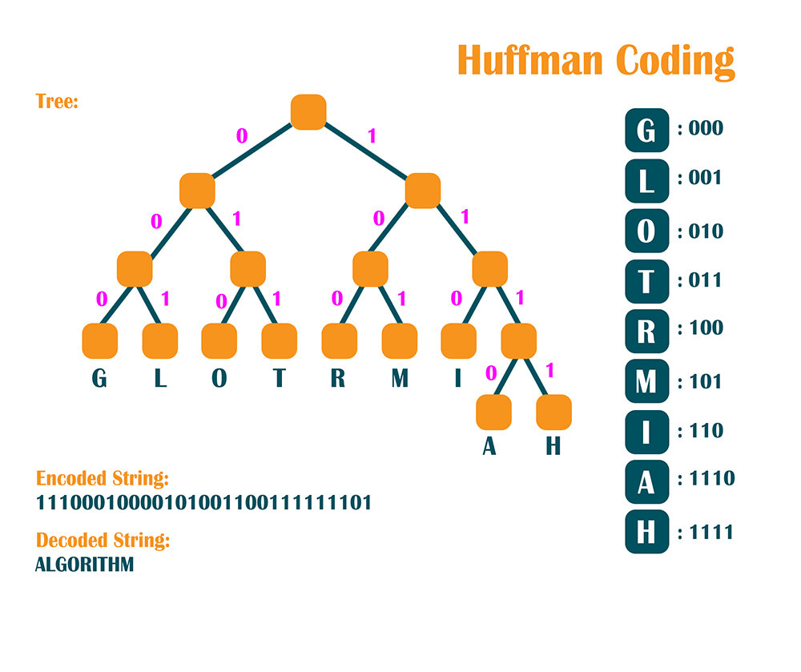

# Static Huffman Coding

Static Huffman coding is a widely used algorithm for lossless data compression, which works by creating a binary tree to represent the most efficient way to encode the data based on the frequency of occurrence of each data element (such as characters in a text). The "static" aspect of it refers to the Huffman tree and the resultant codes being determined before the actual encoding process begins, based on a predetermined set of data or a representative dataset. This tree structure allows for the creation of variable-length codes for each symbol, with the most common symbols being assigned shorter codes and less common symbols receiving longer codes.

## How Static Huffman Coding Works

1. __Frequency Count__: Calculate the frequency of each symbol in the dataset.

2. __Tree Construction__:

* Create a leaf node for each symbol and add it to a priority queue based on its frequency.

* While there is more than one node in the queue:

  * Remove the two nodes of lowest frequency from the queue.
  * Create a new node with these two nodes as children and with a frequency equal to the sum of their frequencies.
  * Add the new node back to the queue.

3. __Generate Codes__:

* Once the tree is constructed, traverse the tree from the root to each leaf node. Assign a binary digit (0 or 1) for each left or right traversal, respectively.

* The path from the root to a leaf node defines the Huffman code for the symbol represented by that leaf.

4. __Encoding__:

* Use the generated Huffman codes to encode the data. Replace each symbol in the input data with its corresponding Huffman code.

5. __Decoding__:

* To decode, start at the root of the Huffman tree and follow the path defined by the binary encoded data (0s and 1s) until reaching a leaf node, which represents the decoded symbol. Repeat this process for the entire encoded data.

## Benefits

* __Efficiency__: Static Huffman coding optimizes the length of the encoded data by reducing the number of bits needed to represent more frequent symbols.

* __Lossless Compression__: It ensures that the original data can be perfectly reconstructed from the compressed data, making it suitable for applications where data integrity is critical.

* __Simplicity__: The algorithm is relatively simple to implement and understand.

## Limitations

* __Static Model__: Since the Huffman tree is built based on a predetermined or representative dataset, static Huffman coding may not be as efficient if the actual dataset differs significantly from the expected frequencies.

* __Overhead__: The Huffman tree or the mapping of symbols to codes must be included with the encoded data to allow for decoding, which can add overhead, especially for small datasets or when the set of symbols is large.

Despite its limitations, static Huffman coding remains a fundamental technique in the field of data compression, appreciated for its simplicity, efficiency, and lossless nature. It is used in various applications, including file compression tools, communication protocols, and multimedia codecs.

## Links

* https://ics.uci.edu/~dan/class/165/notes/zHuff.pdf
* https://en.wikipedia.org/wiki/Huffman_coding

#huffman-static-coding
