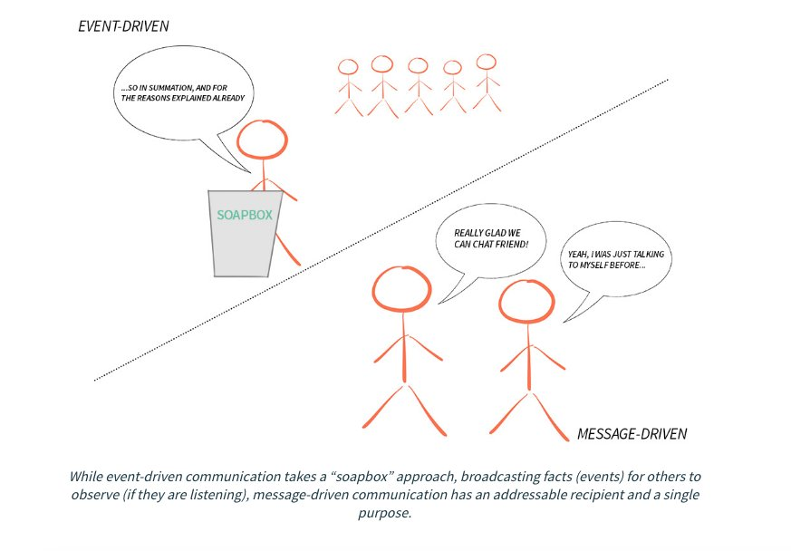

# Reactive Systems

__The Reactive Manifesto__ is a document that outlines a set of design principles for building systems that are more robust, responsive, and scalable. It was first introduced in 2013 and has since been adopted by developers and organizations as a guideline for creating reactive systems, particularly in the context of modern, distributed applications. The manifesto emphasizes the need for systems to be Reactive, defining this term through four foundational principles: Responsive, Resilient, Elastic, and Message Driven.

## Principles

### 1. Responsive

The system must respond in a timely manner if at all possible. Responsiveness is the cornerstone of usability and utility. It also means the system should provide rapid and consistent response times, establishing reliable upper bounds so they deliver a consistent quality of service. This consistent behavior, in turn, simplifies error handling, builds end user confidence, and encourages further interaction.

### 2. Resilient

The system must stay responsive in the face of failure. This applies not only to high-availability, mission-critical systems but to any system that aims to provide a continuous service. Resilience is achieved by replication, containment, isolation, and delegation. Failures are contained within each component, isolating components from each other and thereby ensuring that parts of the system can fail and recover without compromising the system as a whole. Recovery of each component is delegated to another (external) component and high availability is ensured by replication where necessary.

### 3. Elastic

The system must stay responsive under varying workloads. This implies that it can react to changes in the input rate by increasing or decreasing the resources allocated to service these inputs. Elastic systems can scale out within the limits of available hardware and scale back down to save resources when they are not needed. This ability implies that the system is designed to make optimal use of resources, providing scalability without sacrificing performance.

### 4. Message Driven

Reactive systems rely on asynchronous message-passing to establish a boundary between components that ensures loose coupling, isolation, and location transparency. This boundary also provides the means to delegate errors as messages. Employing asynchronous message passing enables load management, elasticity, and flow control by shaping and monitoring the message queues in the system and applying back-pressure when necessary. Message-driven architecture also enables the management of distributed systems with non-blocking communication.

The principles outlined in the Reactive Manifesto encourage the development of systems that are more flexible, loosely coupled, and scalable. These systems are better suited to the demands of modern applications, particularly those that operate within distributed environments such as cloud computing platforms. The manifesto serves as a guide for developers and architects to design systems that can meet contemporary challenges of software development, including handling high loads, maintaining high availability, and providing rich, real-time user experiences.

## Examples

Akka and Erlang provide robust frameworks for building systems that adhere to the reactive principles. They offer different abstractions and operate in different environments (JVM for Akka and Erlang VM for Erlang), but their core philosophies and design choices are aimed at creating systems that are responsive, resilient, elastic, and message-driven. As such, both can be considered as enabling technologies for developing reactive systems, each with its unique set of tools and capabilities tailored to specific requirements and preferences.

## Message-Driven vs. Event-Driven

Both message-driven and event-driven architectures are critical in designing scalable, distributed, and loosely-coupled systems. While they share similarities in promoting asynchrony and decoupling components, there are distinct differences in their approaches, communication models, and use cases.

### Event-Driven Architecture (EDA)

* __Definition__: In event-driven architecture, components communicate with each other through the production, detection, consumption of, and reaction to events. An event is a significant change in state or an update that occurs in the system. When an event happens, it is propagated through the system and handled by one or more interested parties (subscribers).

* __Communication__: EDA is primarily based on a publish-subscribe model, where event producers publish events without knowing who will consume them. Subscribers listen for events they are interested in and react when those events are observed. This model allows for high degrees of decoupling between components.

* __Use Cases__: Event-driven architectures are particularly well-suited for systems where it is essential to react to state changes. These include user interface designs, real-time analytics, monitoring systems, and complex event processing where the emphasis is on the reactive nature of components.

### __Message-Driven Architecture (MDA)__

* __Definition__: Message-driven architecture revolves around the concept of message passing. Components communicate by sending messages to each other. A message is a packet of data that is sent from one component to another, which may include commands, requests, or simply information.

* __Communication__: Unlike EDA, which is about events and reactions, MDA focuses on request-reply and command-message patterns. It often involves message queues that temporarily store messages until they are processed. This model provides a way to ensure that messages are processed reliably and in order, facilitating flow control and enabling backpressure management.

* __Use Cases__: Message-driven architectures are ideal for systems that require reliable integration and communication between distributed components, such as in microservices architectures, where different services need to perform operations in response to requests from other services. It’s also well-suited for implementing workflows and transaction processing where the order and reliability of message processing are crucial.

### Key Differences

* __Focus__: EDA is focused on the state change and notifying interested parties about that change. MDA is focused on the exchange of messages (which may be commands, events, requests, or replies) to ensure a specific action is taken or data is processed.

* __Decoupling__: Both architectures promote decoupling, but they do it differently. EDA decouples components by separating the event producer from the consumer. In contrast, MDA decouples components through message queues and service layers that isolate the message sender from the receiver.

* __Flow Control__: Message-driven systems often have built-in mechanisms for flow control and can exert backpressure by controlling the rate of message processing. Event-driven systems prioritize immediate reaction to events and may not inherently provide the same level of flow control.

* __Reliability and Ordering__: MDA is generally more focused on ensuring message reliability and ordering through queuing mechanisms, making it suitable for scenarios where these aspects are critical. EDA, while it can support reliable event processing, often prioritizes speed and responsiveness.

## Links

* https://www.reactivemanifesto.org/
* https://github.com/akkadotnet/akka.net

#reactive-systems
