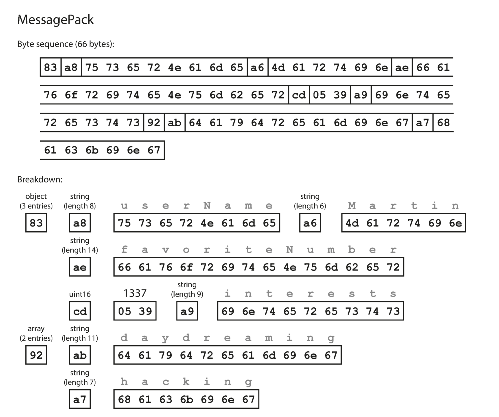
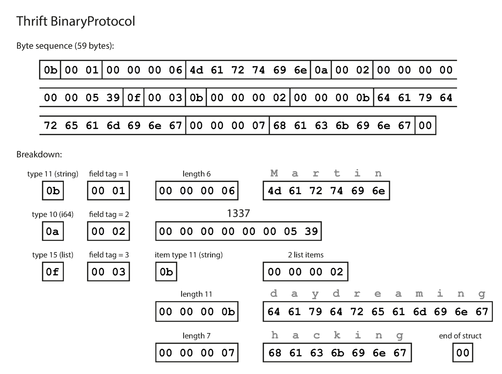
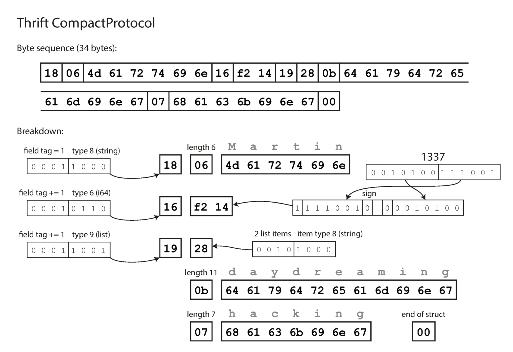
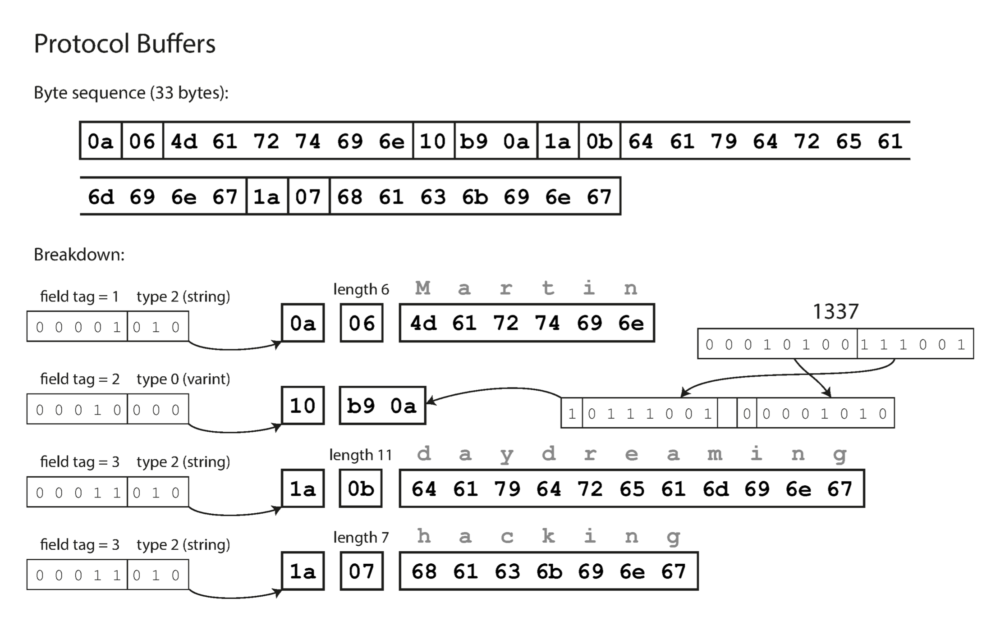
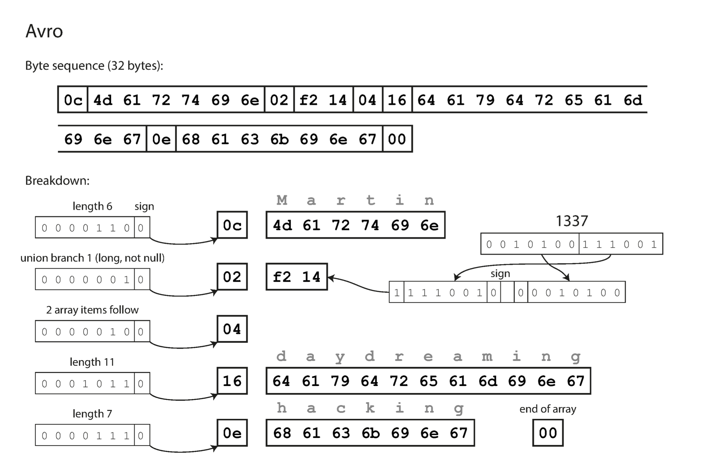

# Data Encodings

## Formats for Encoding Data

Programs usually work with data in (at least) two different representations:

1. In memory, data is kept in objects, structs, lists, arrays, hash tables, trees, and so on. These data structures are optimized for efficient access and manipulation by the CPU (typically using pointers).

2. When you want to write data to a file or send it over the network, you have to encode it as some kind of self-contained sequence of bytes (for example, a JSON document). Since a pointer wouldn’t make sense to any other process, this sequence-of-bytes representation looks quite different from the data structures that are normally used in memory.

## Language-Specific Formats

Many programming languages come with built-in support for encoding in-memory objects into byte sequences. For example, C# has `BinaryFormatter`, Java has `java.io.Serializable`, Ruby has `Marshal`, Python has `pickle`, and so on. Many third-party libraries also exist, such as `Kryo` for Java.

These encoding libraries are very convenient, because they allow in-memory objects to be saved and restored with minimal additional code. However, they also have a number of deep problems:

* The encoding is often tied to a particular programming language, and reading the data in another language is very difficult. If you store or transmit data in such an encoding, you are committing yourself to your current programming language for potentially a very long time, and precluding integrating your systems with those of other organizations (which may use different languages).

* In order to restore data in the same object types, the decoding process needs to be able to instantiate arbitrary classes. This is frequently a source of security problems: if an attacker can get your application to decode an arbitrary byte sequence, they can instantiate arbitrary classes, which in turn often allows them to do terrible things such as remotely executing arbitrary code.

* Versioning data is often an afterthought in these libraries: as they are intended for quick and easy encoding of data, they often neglect the inconvenient problems of forward and backward compatibility.

* Efficiency (CPU time taken to encode or decode, and the size of the encoded structure) is also often an afterthought. For example, Java’s built-in serialization is notorious for its bad performance and bloated encoding.

For these reasons it’s generally a bad idea to use your language’s built-in encoding for anything other than very transient purposes.

## Schema vs. Schemaless

Data encoding formats can be broadly classified into two categories based on whether they require a predefined schema for data serialization and deserialization: __schemaless encodings__ and __encodings with schema__. Understanding the differences between these two approaches is crucial for choosing the right technology for your data storage, transmission, and processing needs.

### Schemaless Encodings

#### Characteristics

* __Flexibility__: Schemaless formats do not require a predefined structure. Data can be serialized and deserialized without a separate schema definition, making these formats highly flexible for dynamic data structures.

* __Self-describing__: Each data piece is self-describing, meaning it carries information about its own structure. This property makes schemaless formats more straightforward for ad-hoc data analysis and debugging.

* __Examples__: JSON, XML, and YAML are common schemaless data formats widely used in web APIs, configuration files, and data interchange.

#### Advantages

* __Ease of Use__: They are generally easier to read and write by humans, and they are supported natively by many programming languages.

* __Flexibility in Data Evolution__: Adding new fields or changing the data structure does not require updating a central schema, which can simplify development in rapidly evolving applications.

#### Disadvantages

* __Size and Performance__: Because each data item includes structural information, schemaless formats can be more verbose, leading to larger data sizes and slower processing speeds compared to schema-based formats.

* __Validation and Compatibility__: Ensuring data integrity and compatibility between different parts of a system can be more challenging without a strict schema.

### Encodings with Schema

#### Characteristics

* __Efficiency__: These formats require a predefined schema that describes the data structure. The schema is used during serialization and deserialization, allowing for more compact and efficient data representation.

* __Separation of Data and Schema__: The schema is defined separately from the data, which means that the data can be encoded in a more compact format without redundant information.

* __Examples__: Protocol Buffers (Protobuf), Apache Avro, and Apache Thrift are examples of schema-based encoding formats. These are often used in system-to-system communication, data storage, and high-performance applications.

#### Advantages

* __Compact and Fast__: By removing redundancy and using efficient binary formats, schema-based encodings significantly reduce data size and improve serialization/deserialization speed.

* __Strong Typing and Validation__: The schema enforces data types and structures, leading to fewer errors and more robust data integrity.

* __Versioning and Evolution__: Schemas can be designed to support forward and backward compatibility, making it easier to evolve data formats over time without breaking existing systems.

#### Disadvantages

* __Complexity in Schema Management__: Requires careful management of schemas to ensure compatibility across different versions and parts of a system.

* __Less Flexibility for Ad-hoc Data__: Adding new fields or changing the data structure requires schema updates, which might not be ideal for applications with highly dynamic data.

### Choosing Between Schemaless and Schema-based Encodings

The choice between schemaless and schema-based encodings depends on several factors, including the application's requirements for performance, data integrity, flexibility, and development overhead. Schema-based encodings are preferred in environments where efficiency, data validation, and compatibility are crucial, such as in large-scale distributed systems, microservices architectures, and data-intensive applications. On the other hand, schemaless formats are often chosen for their ease of use, flexibility, and readability, making them suitable for configuration files, rapid prototyping, and applications with less stringent performance requirements.

## Text Encodings

Text encodings, such as XML, JSON, and CSV, are formats used for structuring and exchanging data. Each format has its own syntax rules and is designed to serve slightly different purposes or preferences in data representation. Understanding these formats is crucial in data interchange, storage, and processing across various computing environments.

### XML (eXtensible Markup Language)

* __Structure__: Hierarchical (tree-like) structure using tags. Attributes can be used within tags.

* __Verbosity__: Tends to be more verbose due to closing tags and can result in larger file sizes compared to JSON.

* __Flexibility__: Highly flexible; can represent complex, nested data structures. Namespaces support allows for elements with the same name to be distinguished.

* __Readability__: Human-readable, but the verbosity can make it less clear than JSON for large datasets.

* __Usage__: Widely used in web services (SOAP), configuration files, and document formats (e.g., Office Open XML).

```xml
<person>
  <name>John Doe</name>
  <email>john.doe@example.com</email>
  <age>30</age>
</person>
```

### JSON (JavaScript Object Notation)

* __Structure__: Data is structured in key/value pairs, arrays, and objects, resembling the way objects are built in JavaScript.

* __Verbosity__: Less verbose than XML, leading to smaller file sizes and faster parsing.

* __Flexibility__: Suitable for representing simple to moderately complex data structures. Lacks some of XML's capabilities like comments and namespaces.

* __Readability__: Highly readable and easy to understand, even for large objects.

* __Usage__: Very popular in web APIs, configuration files, and NoSQL databases due to its simplicity and lightweight nature.

```json
{
  "name": "John Doe",
  "email": "john.doe@example.com",
  "age": 30
}
```

### CSV (Comma-Separated Values)

* __Structure__: Simple, tabular format where each line corresponds to a row in the table, and columns are separated by commas (or sometimes other delimiters like semicolons or tabs).

* __Verbosity__: Very efficient in terms of space, especially for large datasets with a flat structure.

* __Flexibility__: Limited to representing simple, flat data structures. Does not support nesting or complex objects.

* __Readability__: Easily readable with basic text editors and can be directly used in spreadsheet software, but lacks clarity for complex relationships.

* __Usage__: Commonly used for exporting and importing data from databases and spreadsheets, data analysis, and as a simple interchange format.

```csv
name,email,age
John Doe,john.doe@example.com,30
```

## Binary Encodings

For data that is used only internally within your organization, there is less pressure to use a lowest-common-denominator encoding format. For example, you could choose a format that is more compact or faster to parse. For a small dataset, the gains are negligible, but once you get into the terabytes, the choice of data format can have a big impact.

JSON is less verbose than XML, but both still use a lot of space compared to binary formats. This observation led to the development of a profusion of binary encodings for JSON (MessagePack, BSON, BJSON, UBJSON, BISON, and Smile, to name a few) and for XML (WBXML and Fast Infoset, for example). These formats have been adopted in various niches, but none of them are as widely adopted as the textual versions of JSON and XML.

Binary encodings are designed for efficient data serialization, making them ideal for applications requiring compact data representation, fast parsing, and minimal bandwidth usage. Here's a list of popular binary encodings, each with its unique features and use cases:

### Protocol Buffers (Protobuf)

Developed by Google, Protobuf is renowned for its efficiency and support across multiple programming languages. It's widely used in microservices, internal communication protocols, and situations requiring a precise and compact data representation.

### Apache Thrift

Initially developed by Facebook and later donated to the Apache Foundation, Thrift combines a binary serialization format with a robust RPC framework. It supports complex data types and services, making it suitable for building scalable, cross-language services.

### MessagePack

Known for being an efficient binary version of JSON, MessagePack is used in applications that need fast serialization/deserialization and compact data size. It supports a wide array of programming languages and is easy to implement.

### Avro

Part of the Apache Hadoop project, Avro is designed for data serialization in a schema-based format. Its schema evolution capabilities make it a good choice for systems where data schemas change over time, such as big data and streaming applications.

### BSON (Binary JSON)

Originally designed for use in MongoDB, BSON extends JSON with additional data types such as dates and binary data. While not as compact as some other formats, its ease of use in JavaScript and document-oriented databases makes it popular in web development.

### FlatBuffers

Developed by Google for game development and other performance-critical applications, FlatBuffers allows for efficient data reading without parsing/unpacking, reducing CPU and memory usage on client devices.

### Comparison

Let's compare encoding of this example object:

```json
{
  "userName": "Martin",
  "favoriteNumber": 1337,
  "interests": ["daydreaming", "hacking"]
}
```

#### MessagePack



#### Apache Thrift

```thrift
struct Person {
  1: required string userName,
  2: optional i64 favoriteNumber, 3: optional list<string> interests
}
```



The Thrift CompactProtocol encoding is semantically equivalent to BinaryProtocol, but it packs the same information into only 34 bytes. It does this by packing the field type and tag number into a single byte, and by using variable-length integers. Rather than using a full eight bytes for the number 1337, it is encoded in two bytes, with the top bit of each byte used to indicate whether there are still more bytes to come. This means numbers between `–64` and `63` are encoded in one byte, numbers between `–8192` and `8191` are encoded in two bytes, etc. Bigger numbers use more bytes.



#### Protobuf

```protobuf
message Person {
  required string user_name       = 1;
  optional int64  favorite_number = 2;
  repeated string interests       = 3;
}
```



#### Avro

```avro
record Person {
  string userName;
  union { null, long } favoriteNumber = null; array<string> interests;
}
```



#data-encodings
