# Apache Kafka

## Overview


### Log

A log is perhaps the simplest possible storage abstraction. It is an append-only, totally-ordered sequence of records ordered by time. It looks like this:


Records are appended to the end of the log, and reads proceed left-to-right. Each entry is assigned a unique sequential log entry number.

The ordering of records defines a notion of "time" since entries to the left are defined to be older then entries to the right. The log entry number can be thought of as the "timestamp" of the entry. Describing this ordering as a notion of time seems a bit odd at first, but it has the convenient property that it is decoupled from any particular physical clock. This property will turn out to be essential as we get to distributed systems.

### Log-structured Data Flow

The log is the natural data structure for handling data flow between systems. The recipe is very simple:

> Take all the organization's data and put it into a central log for real-time subscription.

The log is the natural data structure for handling data flow between systems. The recipe is very simple:
Take all the organization's data and put it into a central log for real-time subscription.
Each logical data source can be modeled as its own log. A data source could be an application that logs out events (say clicks or page views), or a database table that accepts modifications. Each subscribing system reads from this log as quickly as it can, applies each new record to its own store, and advances its position in the log. Subscribers could be any kind of data system—a cache, Hadoop, another database in another site, a search system, etc.

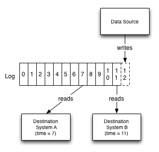

### Kafka at LinkedIn

Kafka was created at LinkedIn.

LinkedIn systems integration before Kafka was introduced:

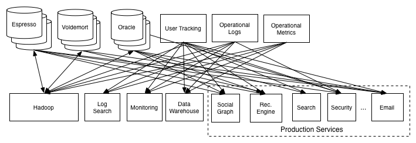

LinkedIn systems integration after Kafka was introduced:

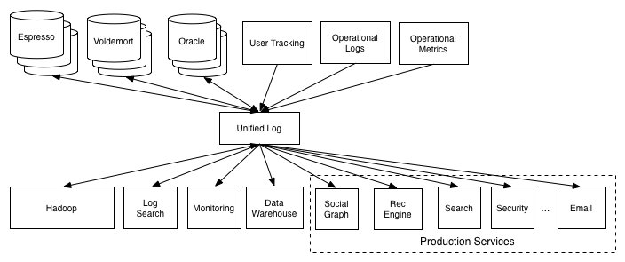

### Links

* https://engineering.linkedin.com/distributed-systems/log-what-every-software-engineer-should-know-about-real-time-datas-unifying

## API

Kafka has five core APIs:

* _The Producer API_. It allows applications to send streams of data to topics in the Kafka cluster.
* _The Consumer API_. It allows applications to read streams of data from topics in the Kafka cluster.
* _The Streams API_. It allows transforming streams of data from input topics to output topics.
* _The Connect API_. It allows implementing connectors that continually pull from some source system or application into Kafka or push from Kafka into some sink system or application.
* _The AdminClient API_. It allows managing and inspecting topics, brokers, and other Kafka objects.

## Brokers

Apache Kafka is a distributed messaging system. A Kafka cluster consists of a set of brokers. A cluster has a minimum of 3 brokers.

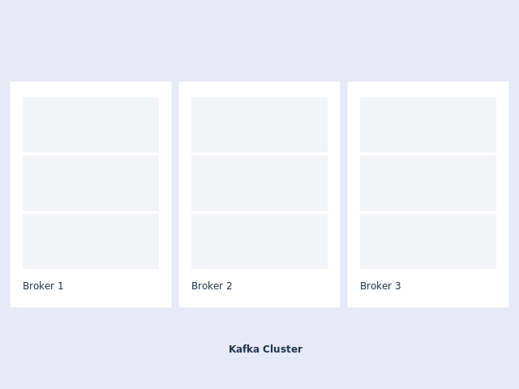

## Messages

A message is a unit of data in Kafka. Each message is represented as a record, which comprises two parts: key and value. The key is commonly used for data about the message and the value is the body of the message. Kafka uses the terms record and message interchangeably.

## Topics and Partitions

Each topic is a named stream of messages. A topic is made up of one or more partitions. The messages on a partition are ordered by a number called the _offset_. By having multiple partitions distributed across the brokers, the scalability of a topic is increased.

If a topic has more than one partition, it allows data to be fed through in parallel to increase throughput by distributing the partitions across the cluster. The number of partitions also influences the balancing of workload among consumers.


Partitions are distributed across the cluster:

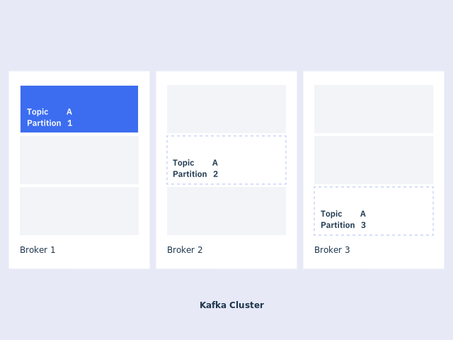

### Changing Partition Count

Changing the partition count of a topic in Apache Kafka involves increasing the number of partitions for a given topic. This is a common task when you need to scale a topic to support higher throughput. Below is a guide on how to do it and some of the implications of such a change.

#### How to Change Partition Count

1. __Determine the New Partition Count__:

Decide how many partitions you want for your topic. This is usually based on the throughput requirements and the number of consumers you plan to have.

2. __Use the Kafka Admin Client__:

You can change the partition count using the Kafka Admin Client command line tool or programmatically via the AdminClient API in your Kafka client library.

  * __Command Line__:

  You can use the kafka-topics.sh script included in the Kafka distribution. Here’s the command to alter the partition count:

  ```bash
  kafka-topics.sh --bootstrap-server <broker-list> --alter --topic <topic-name> --partitions <new-partition-count>
  ```

  Replace `<broker-list>` with your Kafka broker addresses, `<topic-name>` with your topic, and `<new-partition-count>` with the desired number of partitions.

  * __Programmatically__:

  Using C#, for example, you can use the `IAdminClient` interface to alter the partition count:

  ```csharp
  using System;
  using System.Collections.Generic;
  using System.Threading.Tasks;
  using Confluent.Kafka;
  using Confluent.Kafka.Admin;

  public class KafkaAdminExample
  {
      public static async Task Main(string[] args)
      {
          string bootstrapServers = "localhost:9092"; // Replace with your Kafka broker's address
          string topicName = "example-topic"; // Replace with your topic name
          int newPartitionCount = 10; // Desired number of partitions

          var config = new AdminClientConfig { BootstrapServers = bootstrapServers };

          using (var adminClient = new AdminClientBuilder(config).Build())
          {
              try
              {
                  // Define the new partition count for the topic
                  var newPartitions = new List<PartitionsSpecification> {
                      new PartitionsSpecification { Topic = topicName, IncreaseTo = newPartitionCount }
                  };

                  // Perform the partition count increase
                  await adminClient.CreatePartitionsAsync(newPartitions);

                  Console.WriteLine($"Partition count for topic '{topicName}' increased successfully.");
              }
              catch (CreatePartitionsException e)
              {
                  Console.WriteLine($"An error occurred: {e.Results[0].Error.Reason}");
              }
          }
      }
  }
  ```

#### Implications of Changing Partition Count

1. __Data Distribution__:

* New partitions will not have any existing data. Data will start populating in new partitions based on the incoming messages.
* Data in the existing partitions will remain as is, which might lead to uneven data distribution unless a rebalance or redistribution of data is performed.

2. __Consumer Group Impact__:

* If using the `subscribe()` API, consumers will automatically detect new partitions and start consuming from them.
* There might be a temporary imbalance in workload among consumers as new partitions might be assigned to some consumers and not others.

3. __Producer Performance__:

* Producers might see a performance impact as they start distributing messages across more partitions, which can lead to higher latency if not managed properly.

4. __No Shrinking__:

* Kafka does not support reducing the number of partitions for a topic. If you need fewer partitions, you must create a new topic with fewer partitions and migrate the data.

Changing the partition count can help with scaling your Kafka topic, but it should be done with careful consideration of these implications to avoid performance degradation and data imbalance.

## Replication

To improve availability, each topic can be replicated onto multiple brokers. For each partition, one of the brokers is the leader, and the other brokers are the followers.

Replication works by the followers repeatedly fetching messages from the leader.

The total number of replicas including the leader constitute the _replication factor_.

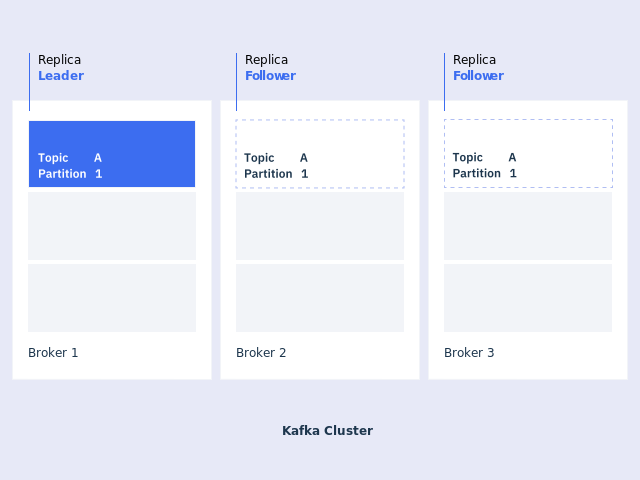

### In-sync Replicas (ISR)

For Kafka node liveness has two conditions:

* A node must be able to maintain its session with ZooKeeper (via ZooKeeper’s heartbeat mechanism).
* If it is a follower it must replicate the writes happening on the leader and not fall “too far” behind.

A follower replica that is keeping up with the partition leader is in-sync. Any follower with an in-sync replica can become the leader without losing any messages.

If the partition leader fails, another leader is chosen from the followers. All the replicas should usually be in-sync. It's acceptable for a replica to be temporarily not in-sync while it's catching up after a failure.

Topics have a setting for the _minimum number_ of in-sync replicas that is checked when the producer requests acknowledgment that a message has been written to the full set of in-sync replicas.

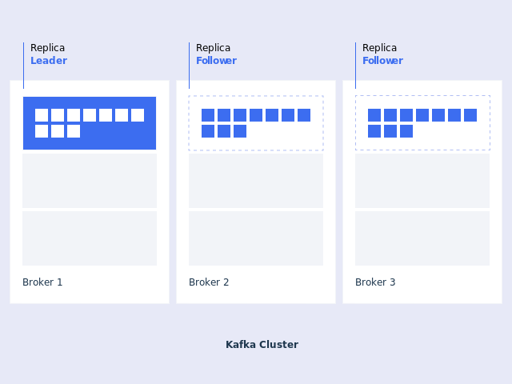

### Quorum

Kafka takes the following approach to choosing its quorum set. Instead of majority vote, Kafka dynamically maintains a set of in-sync replicas (ISR) that are caught-up to the leader. Only members of this set are eligible for election as leader. A write to a Kafka partition is not considered committed until _all_ in-sync replicas have received the write. This ISR set is persisted to ZooKeeper whenever it changes. Because of this, any replica in the ISR is eligible to be elected leader. This is an important factor for Kafka’s usage model where there are many partitions and ensuring leadership balance is important. With this ISR model and `f+1` replicas, a Kafka topic can tolerate `f` failures without losing committed messages.

### Unclean Leader Election

A practical system needs to do something reasonable when all the replicas die. If you are unlucky enough to have this occur, it is important to consider what will happen. There are two behaviors that could be implemented:

* Wait for a replica in the ISR to come back to life and choose this replica as the leader (hopefully it still has all its data).
* Choose the first replica (not necessarily in the ISR) that comes back to life as the leader.

This is a simple tradeoff between availability and consistency. If we wait for replicas in the ISR, then we will remain unavailable as long as those replicas are down. If such replicas were destroyed or their data was lost, then we are permanently down. If, on the other hand, a non-in-sync replica comes back to life and we allow it to become leader, then its log becomes the source of truth even though it is not guaranteed to have every committed message. By default from version 0.11.0.0, Kafka chooses the first strategy and favor waiting for a consistent replica. This behavior can be changed using configuration property `unclean.leader.election.enable`, to support use cases where uptime is preferable to consistency.

### Replica Management

Kafka attempts to balance partitions within a cluster in a round-robin fashion to avoid clustering all partitions for high-volume topics on a small number of nodes. Likewise it tries to balance leadership so that each node is the leader for a proportional share of its partitions.

It is also important to optimize the leadership election process as that is the critical window of unavailability. A naive implementation of leader election would end up running an election per partition for all partitions a node hosted when that node failed. Instead, we elect one of the brokers as the _controller_.

## Producers

A producer publishes messages to one or more topics. A producer can publish to one or more topics and can optionally choose the partition that stores the data.

You can also configure your producer to prioritize speed or reliability by choosing the level of acknowledgement the producer receives for messages it publishes.

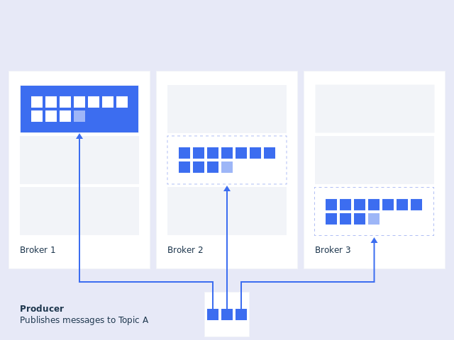

### Load Balancing

The producer sends data directly to the broker that is the leader for the partition without any intervening routing tier. The client controls which partition it publishes messages to. This can be done at random, implementing a kind of random load balancing, or it can be done by some semantic partitioning function. Kafka exposes the interface for semantic partitioning by allowing the user to specify a _key_ to partition by and using this to hash to a partition.

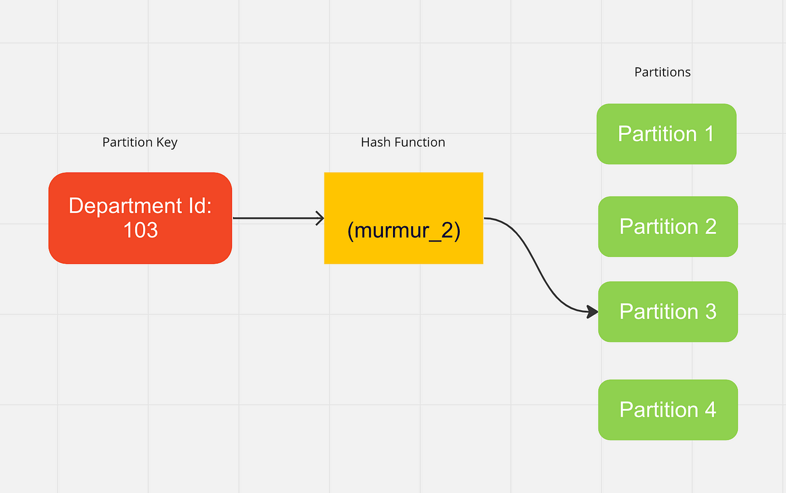

## Consumers

A consumer reads messages from one or more topics and processes them. The difference between a consumer's current position and the newest message on a partition is known as the offset lag.

If the lag increases over time, it is a sign that the consumer is not able to keep up. Over the short term, this is not an issue but eventually the consumer could miss messages if the retention period is exceeded.

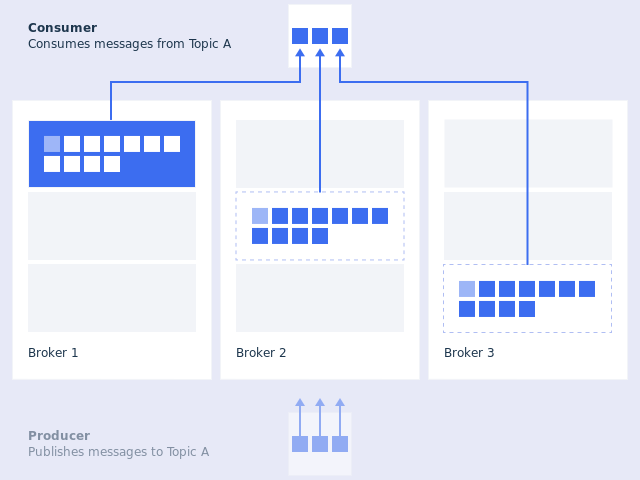

### Pull Model

* The consumer simply falls behind and catches up when it can. A broker does not overwhelm consumers as in the push model.
* Aggressive batching of data sent to the consumer.

### Consumer Position

Most messaging systems keep metadata about what messages have been consumed on the broker.

Kafka handles this differently. A topic is divided into a set of totally ordered partitions, each of which is consumed by exactly one consumer within each subscribing consumer group at any given time. This means that the position of a consumer in each partition is just a single integer, the _offset_ of the next message to consume. This makes the state about what has been consumed very small, just one number for each partition. This state can be periodically checkpointed. This makes the equivalent of message acknowledgements very cheap.

### Offset Management

Kafka does not use consumer acks like NATS Streaming. Instead consumers use offsets. The same options for at-least-once and at-most-once exist.

> But this can be handled more simply and generally by letting the consumer store its offset in the same place as its output.

_Current offset_ (position) is the offset from which next new record will be fetched (when it's available).

_Committed offset_ is the last committed offset for the given partition.

Committing an offset for a partition is the action of saying that the offset has been processed so that Kafka cluster won't send the committed records for the same partition. Committed offset is important in case of a consumer recovery or rebalancing.

There are two ways to commit:

* Auto commit.
* Manual commit.

#### Auto Commit

Auto-commit is the easiest method. You can control this feature by setting two properties: `enable.auto.commit`, `auto.commit.interval.ms`.

#### Manual Commit

It is possible to configure the auto-commit off and manually commit after processing the records. There are two approaches to manual commit:

* Sync commit. Reliable though blocking call.
* Async commit. Unreliable though non-blocking call.

#### Storing Offsets Outside Kafka

Here are a couple of examples of this type of usage:

If the results of the consumption are being stored in a relational database, storing the offset in the database as well can allow committing both the results and offset in a single transaction. Thus either the transaction will succeed and the offset will be updated based on what was consumed or the result will not be stored and the offset won't be updated.

> We can provide exactly-once consumer semantics using this approach.

Each record comes with its own offset, so to manage your own offset you just need to do the following:

* Configure `enable.auto.commit=false`.
* Use the offset provided with each `ConsumerRecord` to save your position.
* On restart restore the position of the consumer using `seek(TopicPartition, long)`.

### Links

https://docs.confluent.io/current/clients/consumer.html

https://kafka.apache.org/10/javadoc/org/apache/kafka/clients/consumer/KafkaConsumer.html#rebalancecallback

## Consumer Groups

A consumer group contains one or more consumers working together to process the messages. The messages from a single partition are processed by one consumer in each group.

At any time, each partition is assigned to only one consumer in the group. This ensures that the messages on each partition are processed in order.

If there are more partitions than consumers in a group, some consumers have multiple partitions. If there are more consumers than partitions, some consumers have no partitions.

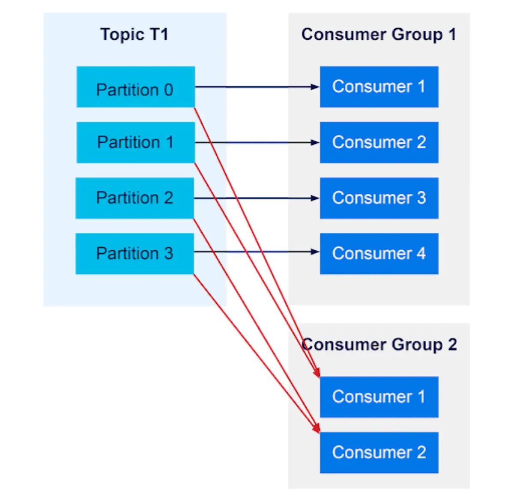

## Rebalancing Protocol

A Kafka consumer group rebalancing is a process that ensures the fair distribution of partition consumption among the consumers in a consumer group connected to a Kafka broker. When consumers join or leave a group, or when topics and partitions change, the rebalancing process is triggered. This process involves reassigning the partitions among the available consumers in the group to ensure that each partition is actively consumed by exactly one consumer at any given time. During rebalancing, consumers temporarily stop consuming messages to allow the coordinator to reallocate partitions effectively. Once the rebalancing is complete, each consumer knows which partitions it should read from, thus resuming normal operation. This mechanism ensures efficient data processing and fault tolerance within Kafka's distributed architecture.

Before rebalancing:

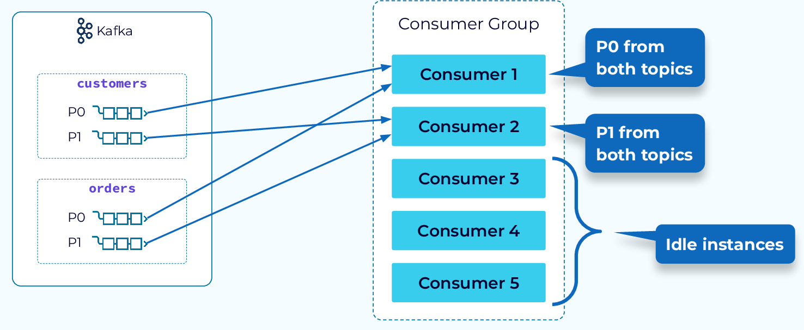

After rebalancing:

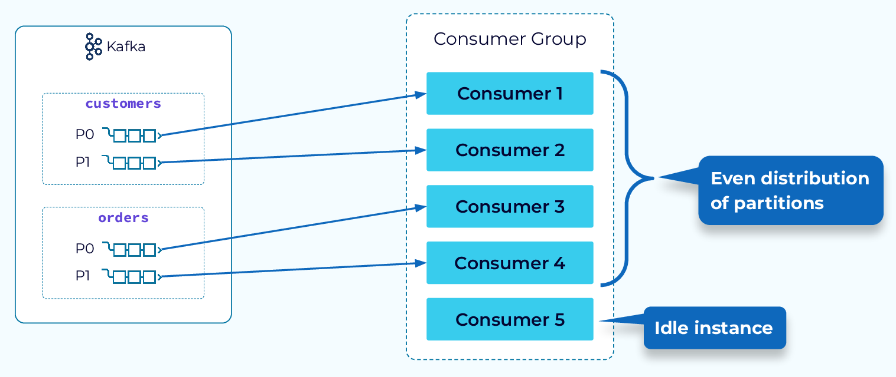

https://medium.com/streamthoughts/apache-kafka-rebalance-protocol-or-the-magic-behind-your-streams-applications-e94baf68e4f2

https://medium.com/streamthoughts/understanding-kafka-partition-assignment-strategies-and-how-to-write-your-own-custom-assignor-ebeda1fc06f3

https://www.nocture.dk/2019/10/27/kafka-my-consumer-group-is-not-balanced/

## Message Delivery Semantics

There are multiple possible message delivery guarantees that could be provided:

* _At most once_. Messages may be lost but are never redelivered.
* _At least once_. Messages are never lost but may be redelivered.
* _Exactly once_. This is what people actually want, each message is delivered once and only once.

It’s worth noting that this breaks down into two problems: the durability guarantees for publishing a message and the guarantees when consuming a message.

When publishing a message we have a notion of the message being _committed_ to the log. Once a published message is committed it will not be lost as long as one broker that replicates the partition to which this message was written remains “alive”.

Prior to 0.11.0.0, if a producer failed to receive a response indicating that a message was committed, it had little choice but to resend the message. This provides _at-least-once_ delivery semantics.

Since 0.11.0.0, the Kafka producer also supports an idempotent delivery option which guarantees that resending will not result in duplicate entries in the log. To achieve this, the broker assigns each producer an _ID_ and deduplicates messages using a _sequence number_ that is sent by the producer along with every message. Also beginning with 0.11.0.0, the producer supports the ability to send messages to multiple topic partitions using transaction-like semantics: i.e. either all messages are successfully written or none of them are. The main use case for this is _exactly-once_ processing between Kafka topics.

> If the producer specifies that it wants to wait on the message being committed this can take on the order of _10 ms_.

The consumer can store its offset in the same place as its output. It leads to exactly-one processing on the consumer side.

### Transactions

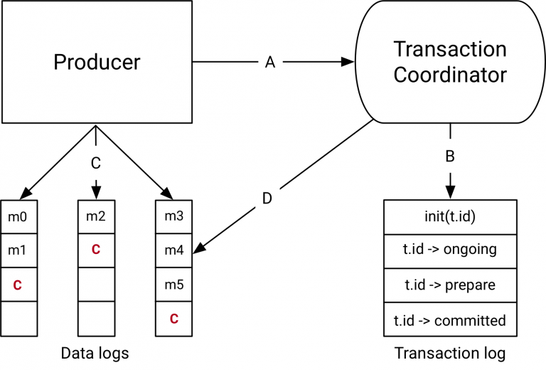

The _transaction coordinator_ is a module running inside every Kafka broker. The _transaction log_ is an internal kafka topic. Each coordinator owns some subset of the partitions in the transaction log, ie. the partitions for which its broker is the leader.

Every `transactional.id` is mapped to a specific partition of the transaction log through a simple hashing function. This means that exactly one coordinator owns a given `transactional.id`.

It is worth noting that the transaction log just stores the latest state of a transaction and not the actual messages in the transaction. The messages are stored solely in the actual topic-partitions. The transaction could be in various states like _Ongoing_, _Prepare commit_, and _Completed_. It is this state and associated metadata that is stored in the transaction log.

The performance overhead is independent of the number of messages written as part of a transaction. So the key to having higher throughput is to include a larger number of messages per transaction. In practice, for a producer producing 1KB records at maximum throughput, committing messages every 100ms results in only a 3% degradation in throughput. Smaller messages or shorter transaction commit intervals would result in more severe degradation.

#### Links

* https://www.confluent.io/blog/exactly-once-semantics-are-possible-heres-how-apache-kafka-does-it/

* https://www.confluent.io/blog/transactions-apache-kafka/

## I/O

### Direct Filesystem Usage

> The key fact about disk performance is that the throughput of hard drives has been diverging from the latency of a disk seek for the last decade. As a result the performance of linear writes on a JBOD configuration with six 7200rpm SATA RAID-5 array is about 600MB/sec but the performance of random writes is only about 100k/sec—a difference of over _6000X_.\
A further discussion of this issue can be found in this [ACM Queue article](http://queue.acm.org/detail.cfm?id=1563874); they actually find that sequential disk access can in some cases be faster than random memory access!

A modern OS will happily divert _all_ free memory to disk caching with little performance penalty when the memory is reclaimed. All disk reads and writes will go through this unified cache.

This suggests a design which is very simple: rather than maintain as much as possible in-memory and flush it all out to the filesystem in a panic when we run out of space, we invert that. All data is immediately written to a persistent log on the filesystem without necessarily flushing to disk. In effect this just means that it is transferred into the kernel’s pagecache.

* Cache of up to 28-30GB on a 32GB machine without GC penalties.
* This cache will stay warm even if the service is restarted.

### Batching

The protocol is built around a _message set_ abstraction that naturally groups messages together. This allows network requests to group messages together and amortize the overhead of the network roundtrip rather than sending a single message at a time. The server in turn appends chunks of messages to its log in one go, and the consumer fetches large linear chunks at a time.

This simple optimization produces orders of magnitude speed up. Batching leads to larger network packets, larger sequential disk operations, contiguous memory blocks, and so on, all of which allows Kafka to turn a bursty stream of random message writes into linear writes that flow to the consumers.

### Compression

Kafka supports GZIP, Snappy, LZ4 and ZStandard compression protocols for batch compression.

### Byte Copying

Modern UNIX operating systems offer a highly optimized code path for transferring data out of pagecache to a socket; in Linux this is done with the `sendfile` system call.

Using `sendfile`, the re-copying is avoided by allowing the OS to send the data from pagecache to the network directly. So in this optimized path, only the final copy to the NIC buffer is needed.

> The combination of pagecache and sendfile means that on a Kafka cluster where the consumers are mostly caught up you will see no read activity on the disks whatsoever as they will be serving data entirely from cache.

## Storage

Each partition is divided into segments. A segment is simply a collection of messages of a partition. Each segment consists of the following files:

1. _Index file_. It maps each offset to its message position in the log file. It is memory-mapped. Binary search is used to search for a specific offset.
2. _Time index file_. It maps timestamps to message positions in the log file.
3. _Log file_. It stores messages. Each message contains its value, offset, timestamp, key, message size, compression codec, checksum, and version of the message format.

Each segment file is created with the offset of the first message as its file name.

```
topicname-2
|-- 000000.index
|-- 000000.log
|-- 000000.timeindex
|-- 000003.index
|-- 000003.log
|-- 000003.timeindex
`--
```

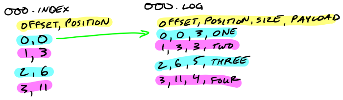

Producers sending compressed messages will compress the batch together and send it as the payload of a wrapped message. And as before, the data on disk is exactly the same as what the broker receives from the producer over the network and sends to its consumers.

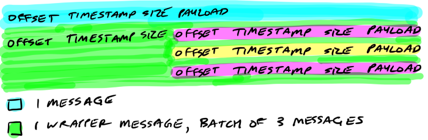

### Links

https://medium.com/@durgaswaroop/a-practical-introduction-to-kafka-storage-internals-d5b544f6925f

https://thehoard.blog/how-kafkas-storage-internals-work-3a29b02e026

## Log Compaction

Log compaction gives us a more granular retention mechanism so that we are guaranteed to retain at least the last update for each primary key (message key also used in partitioning). By doing this we guarantee that the log contains a full snapshot of the final value for every key not just keys that changed recently. This means downstream consumers can restore their own state off this topic without us having to retain a complete log of all changes.

Compaction also allows for deletes. A message with a key and a null payload will be treated as a delete from the log. This delete marker will cause any prior message with that key to be removed (as would any new message with that key).

The compaction is done in the background by periodically recopying log segments. Cleaning does not block reads and can be throttled to use no more than a configurable amount of I/O throughput to avoid impacting producers and consumers. The actual process of compacting a log segment looks something like this:

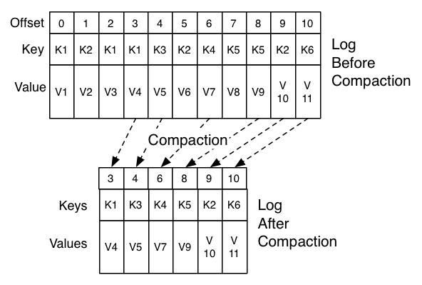

## Quotas

Having quotas protects against these issues and is all the more important in large multi-tenant clusters where a small set of badly behaved clients can degrade user experience for the well behaved ones.

## Zookeeper

## Use Cases

Apache Kafka is beneficial in a variety of domains due to its capabilities in handling large volumes of data streams in real-time. Here are some example domains where Kafka is widely used:

* __E-commerce__: Kafka is used for managing real-time data feeds related to user activity, inventory, order processing, and inter-service communication. This helps in improving customer experiences through personalized recommendations and real-time updates.

* __Finance and Banking__: In financial services, Kafka is crucial for processing transactions, monitoring fraud in real-time, managing multiple payment gateways, and ensuring regulatory compliance through reliable, time-sensitive data processing.

* __Telecommunications__: Kafka supports the high throughput of event processing needed for network monitoring, real-time customer data updates, and billing systems in the telecommunications sector.

* __Healthcare__: Kafka facilitates the real-time processing of patient data, streamlining of hospital operations, and integration of various systems (like electronic health records) for better patient care.

* __IoT (Internet of Things)__: Kafka is ideal for IoT platforms as it can handle massive streams of sensor data, enabling real-time analytics and decision-making for devices in smart homes, industrial IoT, and smart cities.

* __Media and Entertainment__: In media streaming services, Kafka supports real-time processing and monitoring of viewer data to provide content recommendations, manage streaming services, and handle large user loads effectively.

* __Automotive__: Kafka is used in the automotive industry for real-time analytics of vehicle telemetry data, enhancing predictive maintenance, safety features, and autonomous driving technologies.

These domains benefit significantly from Kafka's real-time data processing, durability, and scalability features, making it a central component in their technology stacks.

## Links

* https://docs.confluent.io/current/kafka/design.html

* https://cloud.ibm.com/docs/EventStreams?topic=EventStreams-apache_kafka

* https://stackoverflow.com/questions/29511521/is-key-required-as-part-of-sending-messages-to-kafka

* https://github.com/travisjeffery/jocko

* https://github.com/bulldog2011/bigqueue

* http://bulldog2011.github.io/blog/2013/03/27/the-architecture-and-design-of-a-pub-sub-messaging-system/

#kafka
