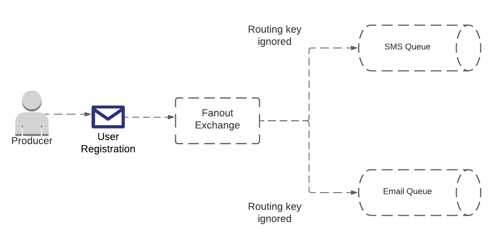

# RabbitMQ

RabbitMQ is a popular open-source message broker software that facilitates the efficient communication between distributed systems by managing the exchange of messages. It serves as an intermediary platform where messages can be sent and received by applications, allowing for decoupled communication, enhanced scalability, and improved fault tolerance.

## Core Features

* __Message Queuing__: RabbitMQ temporarily stores messages until they can be safely processed by the receiving application, ensuring that no data is lost even if the recipient is temporarily unavailable.

* __Routing__: It provides flexible routing capabilities through exchanges, which classify messages before routing them to appropriate queues based on binding rules.

* __Multiple Messaging Protocols__: RabbitMQ supports several messaging protocols, most notably AMQP (Advanced Message Queuing Protocol). It also supports MQTT (for IoT applications), STOMP, and HTTP for diverse application needs.

* __Reliability__: Messages can be set as persistent, and RabbitMQ can be configured for high availability to ensure messages are never lost.

* __Management Interface__: It comes with a web-based management interface that provides insights into and control over queues, connections, and more.

## Main Concepts

* __Producer and Consumer__: Applications that send messages are called producers, and those that receive them are consumers.

* __Exchanges__: Exchanges receive messages from producers and route them to one or more queues based on rules defined as bindings. There are several types of exchanges (direct, topic, fanout, headers) that define different routing behaviors.

* __Queues__: Queues store messages until they are handled by consumers. They ensure that messages are processed in a safe and reliable manner.

* __Bindings__: These are rules that exchanges use to route messages to queues. Bindings can be configured based on routing keys or patterns depending on the exchange type.


## Producers

Producer (also known as __publisher__) is an application component that sends messages to a RabbitMQ broker. Producers are responsible for creating messages and ensuring they are delivered to the appropriate exchanges within the RabbitMQ system. Understanding the role and capabilities of a producer is fundamental to effectively using RabbitMQ for application messaging.

### Key Responsibilities

1. __Message Creation__: The producer generates the message that needs to be sent. This message can contain any type of data, such as strings, serialized objects, or binary data, depending on the application's needs.

2. __Connection Management__: The producer establishes and maintains a connection to the RabbitMQ server. This involves configuring the connection with the necessary parameters such as hostname, port, and credentials.

3. __Channel Creation__: Within an established connection, the producer creates a channel. RabbitMQ uses channels as lightweight connections that share a single TCP connection. Channels help in multiplexing the traffic between the client and the server, improving resource utilization and performance.

4. __Exchange Specification__: The producer sends messages to an exchange, specifying which exchange to use and providing the necessary routing key. The choice of exchange and the routing key determine how the message will be routed to queues.

5. __Message Publishing__: The actual act of sending messages involves the producer invoking a publish operation on the channel. This operation includes specifying the exchange, the routing key, and various message properties like delivery mode (e.g., persistent or non-persistent), priority, and more.

### Message Properties

When sending a message, a producer can set various properties that affect how the message is handled by RabbitMQ and consumers:

* __Delivery Mode__: Determines if the message is transient (not written to disk) or persistent (stored on disk until delivered). Persistent messages are less likely to be lost in case of a node failure.

* __Priority__: Assigns a priority level to the message, influencing the order of message delivery when retrieved by consumers from the queue.

* __Content Type__: Labels the message with a content type (e.g., application/json), which can be useful for consumers in handling the message appropriately.

* __Expiration__: Specifies a time after which the message should be discarded if not delivered.

* __Timestamp__: Marks the message with the time it was created.

* __Message ID, Correlation ID, and Reply-To__: Useful for applications where messages are part of a conversation or workflow, allowing for tracking and proper response routing.

### Reliability Features

Producers can enhance message reliability through several mechanisms:

* __Publisher Confirms__: Allows a producer to receive a confirmation from the broker once messages have been safely handled (either stored in queues or persisted on disk, based on the configuration). This is crucial for ensuring data integrity.

* __Transactional Channels__: Supports grouping a set of actions (like publishing several messages) into a single transaction. The transaction will either complete fully or roll back in case of an error, thus ensuring atomicity.

### Best Practices

* __Connection Stability__: It's recommended to maintain a stable connection and reuse channels for publishing messages rather than frequently opening and closing them.

* __Error Handling__: Implement robust error handling to deal with network issues, broker unavailability, or configuration errors.

* __Resource Management__: Cleanly manage connections and channels, ensuring they are closed properly when no longer needed to prevent resource leaks.

In essence, the RabbitMQ producer is a critical component that initiates the message delivery process in RabbitMQ systems, and understanding its operations and capabilities is key to building effective messaging and task distribution systems.

## Consumers

Consumer (also known as __subscriber__) is an application component that receives messages from queues. The consumer plays a critical role in the message handling process within RabbitMQ's architecture, pulling messages from queues that it has subscribed to and processing them as required by the application.

### Key Responsibilities

1. __Connection Management__: Like producers, consumers must establish a connection to the RabbitMQ server. This involves configuring connection parameters such as hostname, port, and authentication credentials.

2. __Channel Creation__: After establishing a connection, the consumer creates a channel. Channels are virtual connections inside a real TCP connection and are essential for communication with RabbitMQ.

3. __Queue Subscription__: The consumer subscribes to a queue to receive messages. This involves either declaring a queue (if it knows the queue name and configuration) or binding to an existing queue set up by an administrator or another part of the application.

4. __Message Retrieval__: Consumers retrieve messages from queues in one of two ways:

  * __Polling (Pull API)__: The consumer explicitly fetches messages from the queue when it is ready to handle them.
  * __Push (Subscribe API)__: RabbitMQ pushes messages to the consumer as they arrive in the queue. This is managed by setting up a callback function that RabbitMQ calls to deliver each message.

5. __Message Acknowledgment__: After processing a message, the consumer acknowledges it, informing RabbitMQ that the message has been successfully received and processed. This is crucial to ensure that messages aren't lost or redelivered.

### Message Flow and Consumer Operations

* __Basic Consume__: This operation sets up a subscription, telling RabbitMQ to start delivering messages from a specified queue to the consumer. The consumer registers a callback function that will be invoked by RabbitMQ with the delivered message.

* __Basic Get__: An alternative to Basic Consume, this is a polling method where the consumer explicitly requests a message from the queue.

### Consumer Properties

* __Acknowledgments (ACKs)__: To ensure messages are processed, consumers send an ACK once a message is successfully handled. If a consumer fails to process a message, it can send a negative acknowledgment (NACK), or the message can be requeued automatically if the consumer disconnects without sending an ACK.

* __Exclusive Consumer__: This is a consumer that has exclusive access to a queue, preventing other consumers from accessing the same queue.

* __Consumer Tag__: An identifier that RabbitMQ assigns to the consumer for management purposes.

### Consumer Reliability Features

* __Prefetch Count__: Controls how many messages the server will deliver to the consumer before an ACK is received. This is used to limit overloading the consumer.

* __Quality of Service (QoS)__: By setting appropriate QoS settings, including the prefetch count, consumers can manage their workload effectively.

* __Requeue Mechanism__: If a consumer cannot process a message, it can be requeued for redelivery.

### Best Practices

* __Error Handling__: Consumers should implement robust error handling to manage issues like message processing failures or connection problems.

* __Concurrency__: Consumers can handle messages concurrently to improve throughput. This can involve running multiple consumer instances or using multiple channels in a single consumer application.

* __Graceful Shutdown__: When shutting down, consumers should ensure they do not leave messages unacknowledged.

The design of RabbitMQ consumers can significantly affect the performance and reliability of message processing in distributed systems. Efficient consumer implementation ensures that messages are handled promptly and reliably, contributing to the overall effectiveness of using RabbitMQ in a messaging architecture.

## Exchanges

Exchange is a fundamental routing agent that plays a crucial role in the messaging infrastructure. It receives messages from producers and routes them to one or more queues based on defined rules. Exchanges are designed to decouple the producers of messages from the queues that will ultimately store them. This separation ensures that producers do not need to be aware of the specific queues where messages will be sent.

### Types of Exchanges

RabbitMQ supports several types of exchanges, each catering to different routing needs and patterns. Understanding the characteristics and use cases of each exchange type is essential for effectively designing a messaging system. Here are the main types of exchanges available in RabbitMQ:

1. __Direct__

* __Routing Mechanism__: Routes messages to queues based on a routing key that exactly matches the queue binding key.

* __Usage__: Ideal for unicast routing where messages are directed to a specific queue. It's a straightforward, point-to-point communication channel between the producer and the queue.


2. __Fanout__

* __Routing Mechanism__: Ignores the routing key and sends the message to all queues that are bound to it.

* __Usage__: Useful for broadcast scenarios where a message needs to be delivered to multiple consumers simultaneously. This is common in situations where the same data is needed by various parts of an application, such as in real-time updates across different services.



3. __Topic__

* __Routing Mechanism__: Routes messages to one or more queues based on matching between a message routing key and a pattern specified in the binding.

* __Patterns__: Routing keys are typically a sequence of words separated by dots (e.g., "stock.us.nasdaq"). Patterns may include wildcards like * (matches one word) and # (matches zero or more words).

* __Usage__: Suited for selective broadcasting, allowing for the flexibility of routing messages based on multiple criteria expressed through the routing key. This is particularly useful for publishing different types of data to different subscribers based on interest (e.g., market data feeds, log data segregation).


4. __Headers__

* __Routing Mechanism__: Routes messages based on the headers of the message rather than the routing key.

* __Headers__: Are key-value pairs in the message header that are evaluated against the binding criteria.

* __Usage__: Offers the most flexible routing logic that does not rely on the routing key. This can be used for routing decisions based on multiple attributes that describe the message content.


5. __Default (or Nameless) Exchange__

* __Routing Mechanism__: Routes messages to the queue that has the same name as the routing key.

* __Usage__: This is a direct exchange automatically created by RabbitMQ. It simplifies scenarios where each message is routed to a single queue. Very useful for simple, straightforward task distribution where the queue name is known and used directly as the routing key.

### Configurations and Bindings

* __Bindings__: Are rules that link an exchange to a queue based on the exchange type and routing criteria (key or pattern). You can bind multiple queues to the same exchange with different routing criteria, allowing flexible routing logic tailored to specific application needs.

* __Durability and Settings__: Exchanges can be configured as durable or transient. Durable exchanges survive broker restarts, whereas transient exchanges do not. Other settings include security-related options such as who can publish and bindings configurations.

Understanding these exchange types and their routing mechanisms is key to effectively using RabbitMQ to architect robust, efficient, and scalable messaging solutions tailored to the needs of any distributed application or system.

## Queues

Queues are a fundamental component where messages are stored until they can be consumed. Queues hold messages that are sent from producers and deliver them to consumers. They serve as a buffer and help manage the flow of information in a system. Understanding how queues work and their properties is essential for effectively using RabbitMQ.

### Key Characteristics

1. __Durability__

* __Durable Queues__: These queues survive broker restarts. If a queue is declared as durable, messages stored in it will also survive restarts, provided the messages themselves are marked as persistent.

* __Transient Queues__: These do not survive a broker restart, meaning all messages will be lost if the RabbitMQ server is restarted.

2. __Message Durability__

* __Persistent Messages__: Messages can be marked as persistent, meaning they will be written to disk before being considered "received" by RabbitMQ.

* __Non-persistent Messages__: These messages remain in memory and can be lost if the server crashes or restarts.

2. __Exclusivity__

* __Exclusive Queues__: These are queues that can only be accessed by the connection that declared them and will be deleted when the connection closes. They are useful for private temporary queues that should not be accessible by other connections.

3. __Auto-delete__

* __Auto-delete Queues__: These are automatically deleted when the last consumer unsubscribes. If no consumer has ever subscribed, the queue won’t be deleted.

### Queue Operations

1. __Queue Declaration__

This operation creates a queue in RabbitMQ. If a queue with the specified name already exists, the operation will simply open it for use. This operation can also specify parameters like durability, exclusivity, and auto-delete.

2. __Binding Queues to Exchanges__

Queues receive messages from exchanges. For a queue to receive messages from an exchange, it needs to be bound to that exchange with a specific routing key or pattern (depending on the exchange type).

3. __Message Consumption__
Consumers retrieve messages from queues either by subscribing to the queue (where messages are pushed to the consumers as they arrive) or by polling the queue for messages.

### Consumer Acknowledgment

* __Acknowledgments (ACKs)__ are sent back from the consumer to tell RabbitMQ that a message has been received and processed and that RabbitMQ is free to delete it.

* __Negative acknowledgments (NACKs)__ indicate that RabbitMQ should requeue the message, making it available for redelivery.

### Queue Features

1. __Priority Queues__

RabbitMQ supports priority queuing, where each message can be assigned a priority, and the queue will deliver messages in priority order.

2. __Dead Letter Exchanges__

If a message cannot be delivered or processed, it can be sent to a dead letter exchange, from where it can be rerouted or stored for further investigation.

3. __Quorum Queues__

Introduced for high availability and data safety, quorum queues use the Raft consensus algorithm to replicate data across multiple nodes, making them more resistant to node failures.

4. __Queue Length Limit__

RabbitMQ allows setting a maximum length on a queue (either in terms of the number of messages or total memory usage). If the limit is reached, old messages can be dropped or new messages can be rejected based on the queue configuration.

Understanding and configuring queues correctly is critical to leveraging RabbitMQ effectively. Queues act as the buffer that balances the work between producers and consumers, ensuring that messages are safely stored until they can be processed.

## Clients

### .NET

Here's an overview of the main operations you can perform with the RabbitMQ .NET client.

1. __Connecting to a RabbitMQ Server__

To use RabbitMQ, you first need to establish a connection using the ConnectionFactory class, which allows you to set various connection parameters like the host name, username, and password.

```csharp
var factory = new ConnectionFactory()
{
    HostName = "localhost",
    UserName = "guest",
    Password = "guest"
};

using (var connection = factory.CreateConnection())
{
    // Connection has been established
}
```

2. __Declaring a Queue__

Once connected, you can declare a queue where messages will be sent or from which messages will be received. This is typically done on a channel, which is a lightweight connection that shares a single TCP connection.

```csharp
using(var channel = connection.CreateModel())
{
    channel.QueueDeclare(queue: "hello",
                         durable: false,
                         exclusive: false,
                         autoDelete: false,
                         arguments: null);
}
```

3. __Publishing Messages__

To send a message to a queue, you need to publish a message to a channel specifying the queue name.

```csharp
string message = "Hello World!";
var body = Encoding.UTF8.GetBytes(message);

using (var channel = connection.CreateModel())
{
    channel.BasicPublish(exchange: "",
                         routingKey: "hello",
                         basicProperties: null,
                         body: body);
}
```

4. __Subscribing to a Queue__

To receive messages, you need to subscribe to the queue. This usually involves setting up a consumer that waits for messages from RabbitMQ.

```csharp
using (var channel = connection.CreateModel())
{
    var consumer = new EventingBasicConsumer(channel);
    consumer.Received += (model, ea) =>
    {
        var body = ea.Body.ToArray();
        var message = Encoding.UTF8.GetString(body);
        Console.WriteLine(" [x] Received {0}", message);
    };
    channel.BasicConsume(queue: "hello",
                         autoAck: true,
                         consumer: consumer);

    Console.WriteLine(" Press [enter] to exit.");
    Console.ReadLine();
}
```

5. __Handling Acknowledgments__

You can handle message acknowledgments manually to ensure messages are processed successfully before removing them from the queue.

```csharp
using (var channel = connection.CreateModel())
{
    var consumer = new EventingBasicConsumer(channel);
    consumer.Received += (model, ea) =>
    {
        var body = ea.Body.ToArray();
        var message = Encoding.UTF8.GetString(body);
        Console.WriteLine(" [x] Received {0}", message);

        // Acknowledge the message as processed
        channel.BasicAck(deliveryTag: ea.DeliveryTag, multiple: false);
    };
    channel.BasicConsume(queue: "hello",
                         autoAck: false,  // Turn off auto-acknowledge
                         consumer: consumer);
}
```

#### Topic Exchange Operations Example

1. __Publishing Messages to a Topic Exchange__

First, you declare a topic exchange. Unlike direct exchanges, topic exchanges route messages to queues based on wildcard matching between the routing key and the pattern the queue is bound with.

When publishing messages, you specify a routing key that can be used for pattern matching on the consumer side. Let’s assume you want to publish logs with different severities and sources.

```csharp
using (var channel = connection.CreateModel())
{
    channel.ExchangeDeclare(exchange: "topic_logs",
                            type: ExchangeType.Topic);

    var routingKey = "kern.critical";
    string message = "A critical kernel error";
    var body = Encoding.UTF8.GetBytes(message);

    channel.BasicPublish(exchange: "topic_logs",
                         routingKey: routingKey,
                         basicProperties: null,
                         body: body);
    Console.WriteLine(" [x] Sent '{0}':'{1}'", routingKey, message);
}
```

2. __Subscribing to a Topic Exchange__

When publishing messages, you specify a routing key that can be used for pattern matching on the consumer side. Let’s assume you want to publish logs with different severities and sources.

```csharp
using (var channel = connection.CreateModel())
{
    channel.ExchangeDeclare(exchange: "topic_logs",
                            type: ExchangeType.Topic);

    var routingKey = "kern.critical"; // Example routing key
    string message = "A critical kernel error";
    var body = Encoding.UTF8.GetBytes(message);

    channel.BasicPublish(exchange: "topic_logs",
                         routingKey: routingKey,
                         basicProperties: null,
                         body: body);
    Console.WriteLine(" [x] Sent '{0}':'{1}'", routingKey, message);
}
```

## Links

* https://www.rabbitmq.com/
* https://www.youtube.com/watch?v=2F_-Lag-_hE

#rabbitmq
