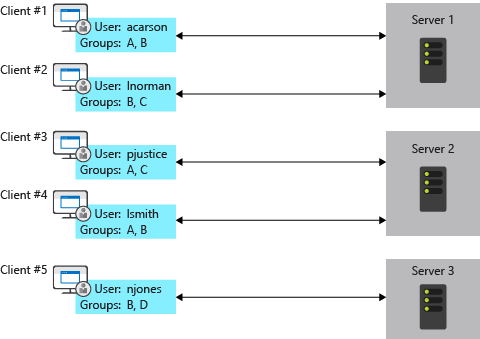
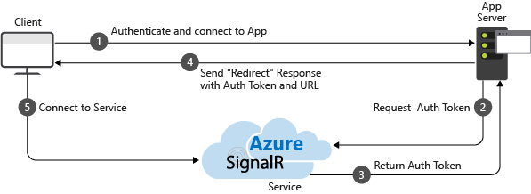

# SignalR

ASP.NET Core SignalR is an advanced library designed to enable real-time web functionality across various applications. It simplifies the process of adding real-time web features to apps by allowing server-side code to send asynchronous notifications to client-side web applications.

## Hubs

SignalR hubs are a core feature of the ASP.NET Core SignalR library, providing a high-level abstraction for handling real-time communication between clients and servers. Hubs allow developers to call client-side JavaScript functions directly from server-side .NET code in real-time, and vice versa, which facilitates complex interactions in a simplified manner.

### Key Features

1. __RPC (Remote Procedure Calls)__:

Hubs enable the server and clients to call methods on each other directly. On the server, you define methods that clients can call, and vice versa. This approach is known as RPC. SignalR takes care of the complex details behind the scenes, such as connection management and method invocation.

2. __Strong Typing with C#__:

With SignalR, you can define interfaces for your hub to enforce a contract between the server and the client. This use of strong typing helps prevent runtime errors and improves code clarity and developer productivity by enabling IntelliSense and compile-time checking in environments like Visual Studio.

3. __Groups__:

Hubs allow you to manage groups of connections, which is useful for broadcasting messages to subsets of connected clients (e.g., a chat room or a specific topic). You can add and remove connections from groups dynamically, and send messages to all members of a group.

4. __Handling Connections__:

Hubs provide lifecycle events such as `OnConnectedAsync`, `OnDisconnectedAsync`, and `OnReconnectedAsync`. These can be overridden to execute custom logic when clients connect, disconnect, or reconnect, which is particularly useful for tracking user presence or cleaning up resources.

5. Asynchronous Patterns:

SignalR hubs support asynchronous programming patterns, which are essential for performing non-blocking operations. This is particularly important in real-time applications to prevent delays in processing incoming messages while waiting for operations like database access or external API calls to complete.

### Example

Here’s a simple example of what a SignalR hub might look like in C#:

```csharp
public class ChatHub : Hub
{
    // Method that clients can call to send a message
    public async Task SendMessage(string user, string message)
    {
        // Broadcasts the message to all connected clients
        await Clients.All.SendAsync("ReceiveMessage", user, message);
    }

    // Called when a new connection is established with the hub
    public override async Task OnConnectedAsync()
    {
        await Clients.All.SendAsync("UserConnected", Context.ConnectionId);
        await base.OnConnectedAsync();
    }

    // Called when a connection is terminated
    public override async Task OnDisconnectedAsync(Exception exception)
    {
        await Clients.All.SendAsync("UserDisconnected", Context.ConnectionId);
        await base.OnDisconnectedAsync();
    }
}
```

On the client side, using JavaScript, you can connect to this hub and call its methods or register functions to respond to calls from the server:

```js
const connection = new signalR.HubConnectionBuilder()
    .withUrl("/chatHub")
    .build();

// Receiving a message from the server
connection.on("ReceiveMessage", function (user, message) {
    console.log(user + " says " + message);
});

// Start the connection
async function start() {
    try {
        await connection.start();
        console.log("SignalR Connected.");
    } catch (err) {
        console.log(err);
        setTimeout(start, 5000);
    }
};

start();

// Send a message to the server
document.getElementById("sendButton").addEventListener("click", function (event) {
    var user = document.getElementById("userInput").value;
    var message = document.getElementById("messageInput").value;
    connection.invoke("SendMessage", user, message).catch(function (err) {
        return console.error(err.toString());
    });
    event.preventDefault();
});
```

Hubs in SignalR facilitate complex interactions between the client and server with relatively simple code, making it easier to build and maintain real-time features in web applications.

## Transports

ASP.NET Core SignalR supports multiple transport options to facilitate real-time communication between clients and servers. These transport mechanisms vary in functionality and are automatically selected based on what the client and server both support and the network environment's capabilities. Here’s an overview of each transport method supported by SignalR:

### WebSockets

WebSockets provide a full-duplex communication channel over a single, long-lived connection. It is the most efficient transport in terms of latency and throughput. WebSockets allow for persistent connections where both the client and server can send data directly to one another without requiring a request/response pattern. SignalR uses WebSockets by default if it is supported by both the client’s and server’s environments.

__Advantages__:

* Lowest latency and overhead, providing the best real-time experience.
* Full-duplex communication allows sending and receiving data simultaneously.
* Supported by all modern browsers and many networking environments.

__Limitations__:

* Not supported in some corporate environments where firewalls or proxies block WebSocket traffic.
* Requires both the client and server to support WebSockets.

### Server-Sent Events (SSE)

Server-Sent Events is a transport that allows the server to push updates to the client over a single, long-lived connection. Unlike WebSockets, SSE is unidirectional from the server to the client, making it a good choice for scenarios where the client primarily listens for data.

__Advantages__:

* Simpler than WebSockets as it doesn’t require special protocol support on the server.
* Generally well supported by modern browsers (except Internet Explorer).

__Limitations__:

* Only allows server-to-client communication. Client messages must be sent using standard HTTP requests.
* Like WebSockets, can be blocked by proxies or firewalls that do not understand the protocol.

### Long Polling

Long Polling is the fallback transport method and is used when neither WebSockets nor Server-Sent Events are available. It involves the client making an HTTP request to the server, which holds the request open until it has data to send back to the client. Once the client receives the data, it immediately makes another request, and the process repeats.

__Advantages__:

* Supported by all browsers because it uses standard HTTP requests.
* Useful in environments with restrictive firewall and proxy settings that prevent other transport methods.

__Limitations__:

* High latency compared to WebSockets and SSE.
* More server resources required because each client is continually making new HTTP connections.

### Transport Selection and Fallback

SignalR automatically selects the best available transport based on the client’s and server’s capabilities and the connectivity conditions. The library starts by trying to establish a WebSocket connection; if that fails, it tries Server-Sent Events, and as a last resort, it falls back to Long Polling. This approach ensures that applications maintain functionality across various environments and conditions.

### Customizing Transport Usage

Developers have the option to configure which transports are allowed for their SignalR applications. This can be useful in scenarios where a specific transport is preferred or required due to client or network constraints.

## Communication Protocols

SignalR supports two primary protocols for encoding messages:

1. __JSON__: This is the default protocol and uses the JavaScript Object Notation format for message encoding. JSON is text-based, human-readable, and supported in most programming environments, making it highly interoperable and easy to use in web applications.

2. __MessagePack__: As an alternative to JSON, MessagePack offers a binary serialization format, which reduces the payload size—ideal for scenarios requiring reduced latency and bandwidth conservation. While it is not human-readable like JSON, it is more efficient in terms of parsing and data transfer.

Both protocols are supported natively by the SignalR client and server libraries, and developers can choose either based on their specific application needs.

## Real-Time Streaming

SignalR supports both server-to-client and client-to-server streaming:

* __Server-to-Client Streaming__: This feature allows the server to send continuous streams of data to the client. This is useful in scenarios like sending live feeds or ongoing data like sensor outputs.

* __Client-to-Server Streaming__: Conversely, clients can also send streams of data to the server. This is beneficial in scenarios where the client needs to upload large amounts of data or continuous data streams to the server.

## Scaling SignalR

An app that uses SignalR needs to keep track of all its connections, which creates problems for a server farm. Add a server, and it gets new connections that the other servers don't know about. For example, SignalR on each server in the following diagram is unaware of the connections on the other servers. When SignalR on one of the servers wants to send a message to all clients, the message only goes to the clients connected to that server:



SignalR can be scaled out in two primary ways:

* __Azure SignalR Service__: This is a fully managed service that automatically handles scaling and managing persistent connections. It's the simplest way to scale a SignalR application and is recommended for applications deployed on Azure.




* __Redis Backplane__: For applications not running on Azure, using a Redis backplane can help scale out SignalR apps across multiple servers. Redis distributes messages to other servers in the SignalR application, ensuring that all clients connected to any server receive the appropriate messages.


### Sticky Sessions

Sticky sessions are used in SignalR primarily to maintain a stable and continuous connection state between the client and the server, which is critical for the effective functioning of real-time communication features. Here are the main reasons why sticky sessions are particularly important in the context of SignalR:

1. __Connection State Management__: SignalR maintains a state for each connection that includes connection IDs, subscriptions to specific hubs, and other user-related data. This state is crucial for the server to manage ongoing communication and send appropriate messages to the right clients. If a client were to connect to a different server with each request (in a load-balanced environment without sticky sessions), this state would need to be recreated or synchronized across servers, complicating the architecture and potentially leading to errors or lost data.

2. __Efficiency and Performance__: Without sticky sessions, every time a client makes a new connection request that is handled by a different server, that server needs to establish the context and state for that connection. This can lead to additional overhead and slower performance because each server must either retrieve the state from a central store or establish a new state entirely. Sticky sessions eliminate this overhead by ensuring that the client consistently communicates with the same server, which already has the relevant state in memory.

3. __Simplification of Scaling__: Scaling a real-time application horizontally (adding more servers) is more complex when connection states are distributed across multiple servers. Sticky sessions simplify this by ensuring that all messages from a specific client are handled by the same server, reducing the need for complex synchronization mechanisms across servers. This is especially useful in environments that use WebSocket, which is a stateful protocol; maintaining a connection to the same server avoids the need for frequent handshakes and authentication checks.

4. __Real-time Interaction__: Real-time applications often involve rapid exchanges of messages, such as in chat applications, live notifications, or interactive games. Maintaining a continuous and stable connection via sticky sessions ensures that these interactions are delivered promptly and reliably, without delays that might occur from connection rerouting or state synchronization.

__!!! When all clients are configured to only use WebSockets, and the `SkipNegotiation` setting is enabled in the client configuration sticky sessions ARE NOT needed !!!__

## Integration with ASP.NET Core Features

SignalR is tightly integrated with ASP.NET Core features like Dependency Injection (DI) and logging. This makes it easy to use SignalR alongside other parts of the ASP.NET Core ecosystem, such as MVC, Authorization, and Authentication mechanisms.

## Client SDKs

SignalR supports a variety of client SDKs including JavaScript, .NET (for UWP, WPF, etc.), and even native mobile apps through Java for Android and Swift for iOS. This broad support ensures that applications can maintain real-time communication across different platforms and devices.

## Use Cases

Common use cases of SignalR include:

* __Notifications__: Pushing real-time updates and alerts to users.

* __Dashboards__: Real-time monitoring systems that update continuously.

* __Collaborative Applications__: Apps like real-time editors where users see live changes made by other users.

* __Live Chat and Instant Messaging__: Applications that require immediate client-server communication.

## Links

* SignalR Overview - https://learn.microsoft.com/en-us/aspnet/core/signalr/introduction?view=aspnetcore-8.0
* SignalR Protocol - https://github.com/dotnet/aspnetcore/blob/main/src/SignalR/docs/specs/HubProtocol.md
* SignalR Hubs - https://learn.microsoft.com/en-us/aspnet/core/signalr/hubs?view=aspnetcore-8.0
* SignalR Groups - https://learn.microsoft.com/en-us/aspnet/signalr/overview/guide-to-the-api/working-with-groups
* SignalR Streaming - https://learn.microsoft.com/en-us/aspnet/core/signalr/streaming?view=aspnetcore-8.0
* SignalR Configuration - https://learn.microsoft.com/en-us/aspnet/core/signalr/configuration?view=aspnetcore-8.0&tabs=dotnet
* MessagePack in SignalR - https://learn.microsoft.com/en-us/aspnet/core/signalr/messagepackhubprotocol?view=aspnetcore-8.0
* SignalR Hosting and Scaling - https://learn.microsoft.com/en-us/aspnet/core/signalr/scale?view=aspnetcore-8.0

#signalr
