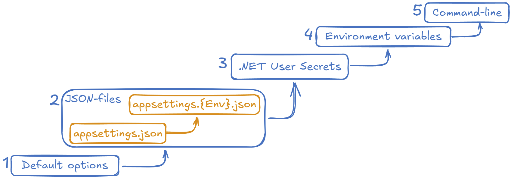

* [.NET Configuration and Options Pattern](#net-configuration-and-options-pattern)
  * [Why Use the Options Pattern?](#why-use-the-options-pattern)
  * [Sources of Options](#sources-of-options)
    * [Default Options](#default-options)
    * [JSON Files](#json-files)
    * [.NET User Secrets](#net-user-secrets)
    * [Environment Variables](#environment-variables)
    * [Command-Line Arguments](#command-line-arguments)
  * [Basic Concepts](#basic-concepts)
    * [`IConfiguration` as Key-Value Structure](#iconfiguration-as-key-value-structure)
    * [Bind](#bind)
    * [Configure](#configure)
    * [Use `set` in Properties](#use-set-in-properties)
  * [How to use `Options`](#how-to-use-options)
    * [Simplest Way via `.Configure`](#simplest-way-via-configure)
    * [Preferred Way via `.AddOptions`](#preferred-way-via-addoptions)
    * [Injecting Options in Classes](#injecting-options-in-classes)
      * [`IOptions<TOptions>`](#ioptionstoptions)
      * [`IOptionsSnapshot<TOptions>`](#ioptionssnapshottoptions)
      * [`IOptionsMonitor<TOptions>`](#ioptionsmonitortoptions)
      * [`IOptionsFactory<TOptions>`](#ioptionsfactorytoptions)
    * [Named Options](#named-options)
  * [Links](#links)

# .NET Configuration and Options Pattern

## Why Use the Options Pattern?

The .NET Options Pattern is a recommended approach for handling configuration in a clean, maintainable, and testable way. It offers two key advantages:

* __Encapsulation__: It allows you to encapsulate related configuration settings within strongly-typed classes. This ensures that each part of your application only accesses the settings it needs, promoting clarity and reducing the risk of errors.

* __Separation of Concerns__: By isolating configuration logic from the rest of your application code, the Options Pattern helps maintain a clear separation of concerns. You can easily adjust settings or provide new sources of configuration without impacting the underlying business logic.

## Sources of Options

The .NET Options pattern allows configuring settings from various sources, ensuring flexibility and adaptability to different environments. Below are the primary sources:


Numbers and arrows point to the default order for applying. Later sources overwrite earlier sources. Order possible to be changed.

### Default Options

Default values can be set directly in the `Options` class, which will be used if no configuration is provided from other sources.

```csharp
public class UserServiceOptions
{
    public const string ConfigSectionPath = "Services:UserService";
    
    public required Uri Url { get; set; } = new Uri("https://default.url");
    public TimeSpan Timeout { get; set; } = TimeSpan.FromSeconds(30);
}
```

### JSON Files

Configurations are often stored in JSON files, such as `appsettings.json`, where you can define your options in a hierarchical structure. `Env` for `appsettings.{Env}.json` taking from environment variable `ASPNETCORE_ENVIRONMENT`.

```json
{
  "Services": {
    "UserService": {
      "Url": "https://api.userservice.com",
      "Timeout": "00:01:00"
    }
  }
}
```

### .NET User Secrets

For sensitive information like API keys or connection strings during development, you can use the .NET User Secrets. This keeps sensitive data out of your source control while still integrating it into the options.

```bash
dotnet user-secrets set "Services:UserService:Url" "https://secure.api.user-service.com"
dotnet user-secrets set "Services:UserService:Timeout" "00:01:00"
```

### Environment Variables

Environment variables allow you to override configuration values without modifying code or configuration files. These are especially useful in cloud environments or for different deployment environments. `__` is used as the delimiter here for config sections.

```bash
SET Services__UserService__Url=https://env-specific.url
SET Services__UserService__Timeout=00:02:00
```

### Command-Line Arguments

Settings can be overridden via command-line arguments.

```bash
dotnet run --Services:UserService:Url=https://cmdline.url --Services:UserService:Timeout=00:02:30
```

## Basic Concepts

### `IConfiguration` as Key-Value Structure

At its core, `IConfiguration` is a key-value store used to manage application settings. Each key represents a configuration item, and values can be simple strings or complex objects. Configuration keys are often hierarchical, allowing sections of configuration to be organized logically, such as: `Services:UserService:Url`

This hierarchy enables mapping configuration values directly to strongly-typed classes.

### Bind

The __Bind__ concept maps configuration sections to strongly-typed classes. This ensures type safety and enables auto-completion and validation features in your IDE.

### Configure

The `Configure` method allows options to be set up in different ways. You can configure options directly in code, from external sources (such as a configuration file), or dynamically based on runtime conditions.

### Use `set` in Properties

It is recommended to use the `set` accessor for properties in your options classes to allow flexibility in how options are configured. This ensures that values can be assigned from configuration sources such as JSON files, environment variables, or command-line arguments. Additionally, you can use `required` properties to ensure that crucial settings are always provided and don't rely on default values.

```csharp
public required Uri Url { get; set; }
```

## How to use `Options`

### Simplest Way via `.Configure`

The simplest way to use options is by calling `.Configure<TOptions>`. This binds a specific configuration section to a strongly-typed options class.

```csharp
services.Configure<UserServiceOptions>(Configuration.GetSection(UserServiceOptions.ConfigSectionPath));
```

This is quick and effective for basic usage, but may lack flexibility for more complex scenarios.

### Preferred Way via `.AddOptions`

The preferred way to use options is through `.AddOptions<TOptions>`. This method offers more fine-tuning, including validation, and dependency injection into option configuration.

```csharp
services
    .AddOptions<UserServiceOptions>()
    .Bind(Configuration.GetSection(UserServiceOptions.ConfigSectionPath))
    .ValidateDataAnnotations()  // Optionally add validation
    .Validate(options => options.Timeout.TotalSeconds > 0, "Timeout must be greater than 0.");
```

This approach allows you to add more configuration logic, such as validation or post-configuration hooks.

### Injecting Options in Classes

Once the options are configured, they can be injected into your classes via `IOptions<T>`.

```csharp
public class UserServiceClient
{
    private readonly UserServiceOptions _options;

    public UserServiceClient(IOptions<UserServiceOptions> options)
    {
        _options = options.Value;
    }

    public void MakeRequest()
    {
        var url = _options.Url;
        var timeout = _options.Timeout;

        // Use the options in your logic
    }
}
```

#### `IOptions<TOptions>`

* Does __not__ support:
  * Reading of configuration data after the app has started.
  * Named options
* Is registered as a __Singleton__ and can be injected into any service lifetime.

#### `IOptionsSnapshot<TOptions>`

* Is useful in scenarios where options should be recomputed on every injection resolution. So, are possible _performance concerns_
* Is registered as __Scoped__ and therefore cannot be injected into a Singleton service.
* Supports named options

#### `IOptionsMonitor<TOptions>`

* Is used to retrieve options and manage options notifications for `TOptions` instances.
* Is registered as a __Singleton__ and can be injected into any service lifetime.
* Supports:
  * Change notifications
  * Named options
  * Reloadable configuration
  * Selective options invalidation (`IOptionsMonitorCache<TOptions>`)

#### `IOptionsFactory<TOptions>`

* Is registered as a __Singleton__ and can be injected into any service lifetime.
* It creates a new options instance for every `Create` method call. So, are possible _performance concerns_

### Named Options

//TODO Add description for named options

## Links

https://learn.microsoft.com/en-us/dotnet/core/extensions/configuration

https://learn.microsoft.com/en-us/dotnet/core/extensions/options

#dotnet-configuration
