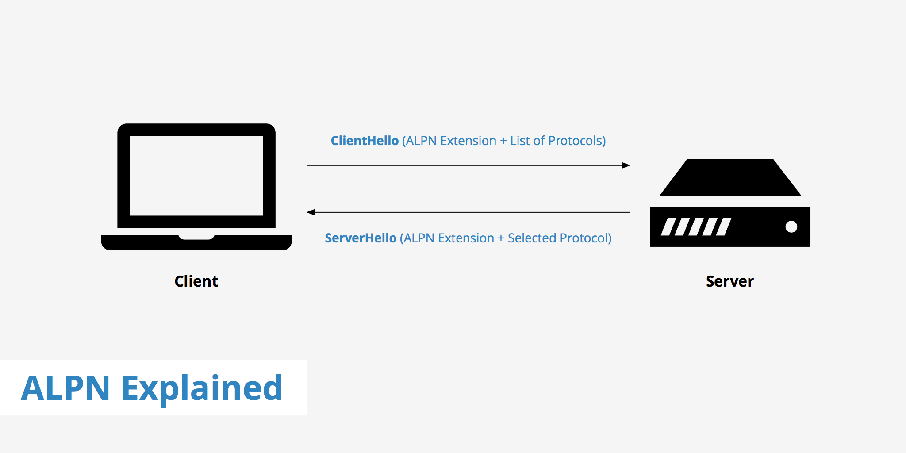

# Application-Layer Protocol Negotiation

Application-Layer Protocol Negotiation (ALPN) is a TLS extension that allows for the negotiation of the application protocol to be used over a secure connection. Introduced to improve upon its predecessor, the Next Protocol Negotiation (NPN) extension, ALPN enables the client and server to select a mutually supported protocol directly within the TLS handshake, eliminating extra round trips and reducing latency.

## How ALPN Works

1. __ClientHello Message__: During the TLS handshake, the client sends a list of supported application protocols as part of the `ClientHello` message. This list is ordered by the client's preference.

2. __Server Selection__: The server, upon receiving the `ClientHello` message, looks at the client’s list of protocols and selects the most preferred protocol that it also supports.

3. __ServerHello Message__: The server includes its protocol selection in the `ServerHello` message, which is sent back to the client. This confirms the application protocol that will be used for the duration of the TLS connection.

4. __Secure Communication__: Once the handshake is complete, both the client and server proceed to communicate using the agreed-upon application protocol, such as HTTP/2 or HTTP/1.1, over the secured TLS connection.

## Importance of ALPN

* __Efficiency and Performance__: ALPN reduces the time to establish a secure connection by integrating application protocol negotiation into the TLS handshake process. This is especially beneficial for protocols like HTTP/2, where rapid setup and reduced latency are crucial.

* __Security__: ALPN occurs within the secure context of the TLS handshake, ensuring that the negotiation process is protected from eavesdropping and tampering. This is a significant improvement over previous methods, such as using unsecured HTTP headers or relying on out-of-band mechanisms.

* __Simplification__: By using ALPN, applications and services can simplify their network architectures. There's no need for additional steps or protocols to determine the application protocol to be used, as it's all handled as part of establishing the TLS connection.

* __Versatility__: ALPN supports a wide range of application protocols, making it a flexible solution that can be used in various scenarios, from web servers serving HTTP/2 content to new and emerging protocols requiring secure negotiation.

## Implementation and Support

ALPN is widely supported by modern web servers, browsers, and libraries. Its adoption has been driven by the need for efficient, secure protocol negotiation, particularly with the rise of HTTP/2. Developers working with TLS libraries need to ensure that they configure ALPN with the desired protocols to ensure correct negotiation and optimal performance of their applications.

In summary, ALPN plays a critical role in modern secure communication on the internet, enabling efficient and secure negotiation of application protocols within the TLS handshake, enhancing both performance and security.

## Links

* https://en.wikipedia.org/wiki/Application-Layer_Protocol_Negotiation
* https://www.keycdn.com/support/alpn

#alpn
