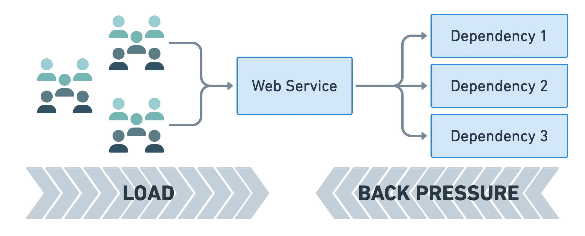

# Backpressure

The backpressure design pattern is a crucial concept in systems design, particularly in stream processing and reactive systems. It addresses the scenario where various components or services in a distributed system operate at different speeds. Backpressure provides a way to handle situations where a fast producer generates data at a rate that a slower consumer cannot keep up with, which can lead to resource exhaustion, such as memory overflow or system crashes.

## Key Principles

The core idea of backpressure is to prevent the system from being overwhelmed by moderating the flow of data based on the consumer's capacity to process that data. This is typically achieved through a feedback mechanism where the consumer can signal to the producer how much data it is capable of handling at a given time. Here are the primary principles:

1. __Consumer-Driven Flow Control__: The consumer dictates the pace of data processing, ensuring that it only receives as much data as it can handle without becoming overwhelmed.

2. __Dynamic Adjustment__: The system dynamically adjusts the data flow rate based on current conditions, such as network latency, system load, and processing speed of the consumer.

3. __Resource Awareness__: The implementation of backpressure is sensitive to the system's resource limits, such as CPU usage, memory constraints, and I/O capacity.

## Implementing Backpressure

Backpressure can be implemented in various ways, depending on the architecture and technology stack:

* __Reactive Streams Specification__: Many modern programming frameworks and libraries adhere to the Reactive Streams specification, which provides a standard for asynchronous stream processing with non-blocking backpressure. This is supported in languages like Java (Project Reactor, RxJava), Scala (Akka Streams), and JavaScript (RxJS).

* __Message Queues__: Systems like Kafka or RabbitMQ can implement backpressure by limiting the number of unacknowledged messages in a queue. The consumer controls the pace at which messages are processed and acknowledged.

* __Flow Control Protocols__: Protocols like TCP use flow control mechanisms (like window scaling) to manage the rate of data transmission based on the receiver's capacity, which is a form of network-level backpressure.

* __Batch Processing and Buffering__: Limiting the size of data batches sent to a consumer and using buffers judiciously can serve as a simple form of backpressure. This ensures that the consumer isn't sent more data than it can process at once.

## Examples of Backpressure in Use

* __Streaming Data Pipelines__: In a real-time data processing pipeline, a backpressure mechanism ensures that if the data processing component slows down, the incoming flow of data from the source (e.g., live event streams) is throttled to match the processor's capacity.

* __Web Server Requests Handling__: Web servers implement backpressure by limiting the number of concurrent requests they handle. This can be seen in asynchronous web frameworks that manage request handling based on current load and available resources.

* __Reactive Applications__: Applications built with reactive frameworks like Vert.x or Spring WebFlux inherently support backpressure to manage event-driven data flows without blocking threads, adjusting to the pace at which events can be processed.

## Benefits

Implementing backpressure improves system resilience and stability by:

* __Avoiding Resource Saturation__: Prevents the system from using up all available memory or processing power on unmanageable workloads.

* __Enhancing User Experience__: Maintains system responsiveness under load by ensuring that tasks are completed at a sustainable rate.

* __Reducing System Failures__: Minimizes the risk of crashes and failures due to overload.

By thoughtfully applying the backpressure pattern, systems can be designed to be more scalable and robust, particularly in environments characterized by high volume and high variability in data rates.

#backpressure
