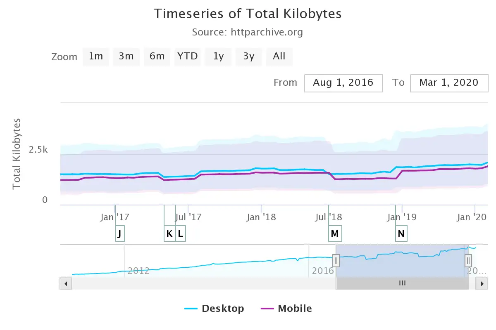
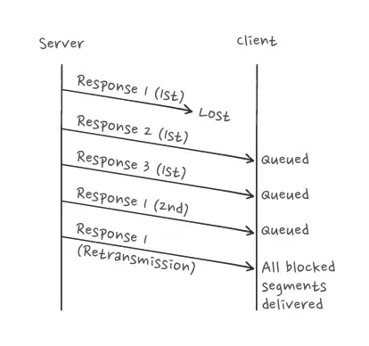
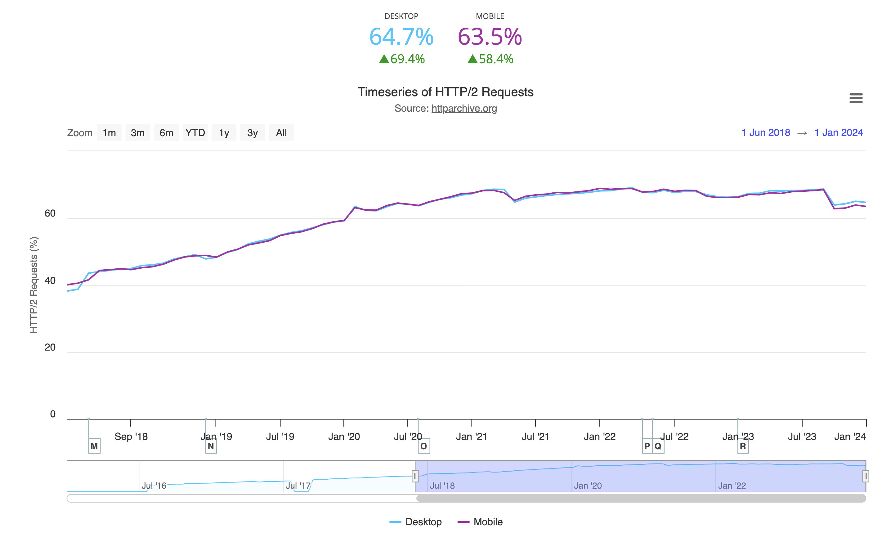

# HTTP/2

HTTP/2 is a replacement for how HTTP is expressed “on the wire.” It is not a ground-up rewrite of the protocol; HTTP methods, status codes and semantics are the same, and it should be possible to use the same APIs as HTTP/1.x (possibly with some small additions) to represent the protocol.

The focus of the protocol is on performance; specifically, end-user perceived latency, network and server resource usage. One major goal is to allow the use of a single connection from browsers to a Web site.

The basis of the work was SPDY, but HTTP/2 has evolved to take the community’s input into account, incorporating several improvements in the process.

## HTTP/1.1 Problems

Use of the Internet grew steadily during the years of the new millennium, underpinned by HTTP/1.1. Meanwhile, websites kept steadily growing bigger and more complex. This graph from the State of the Web report shows a 30.6% increase in median size of desktop websites between November 2016 and November 2017, and a 32.3% increase in mobile versions of these websites.



Users do not take kindly to slow-loading websites. By November 2019, the median time for first contentful paint (FCP) for sites visited from desktop computers was __2.4 seconds__. For mobile devices, the median time for FCP was __6.4 seconds__. To keep a reader’s attention uninterrupted, FCP should be under one second.

Much of the lag was down to the limitations of HTTP/1.1. Let’s look at some of these limitations and developer hacks for overcoming them.

### Head-of-Line Blocking

Head-of-line blocking increases website response time when a sequence of packets is held up because one or more packets are blocked. A client sends a request to a server in HTTP/1.1, connecting over Transmission Control Protocol (TCP), and the server must return a complete response before the connection can be used again. Subsequent requests will not be able to use the TCP connection until the response is completed.



_Responses 2 and 3 are blocked until response 1 is retransmitted and delivered._

At first, browsers were allowed only two concurrent connections to a server, and the browser had to wait till one of them was free, creating a bottleneck. The workaround of allowing browsers to make six concurrent connections only postponed the problem.

Developers started using _domain sharding_ to split content across multiple subdomains. This allowed browsers to download more resources at the same time, which made the website load faster. This came at a cost of increased development complexity and increased overhead from the TCP connection setup.

### Repetitive Headers & Cookies

HTTP is a stateless protocol, and each request is independent. Server and client exchange additional request and response metadata. Every HTTP request initiated by the browser carries around 700 bytes of metadata. Servers use cookies for session management. With a cookie added to every request, protocol overhead increases.

The workaround was developers using “cookieless” domains to serve static files like images, CSS, and JavaScript that didn't need cookies.

### TCP Slow Start

TCP slow start is a feature of the protocol in which the network is probed to figure out the available capacity. HTTP over TCP does not use full bandwidth capacity from the start. Small transfers are expensive over TCP. To overcome the TCP slow start, developers used hacks like concatenating JavaScript & CSS files, and spriting small images.

### Solution

In 2009, Google announced SPDY, an experimental protocol. This project had the following high-level goals:

* Target a 50% reduction in page load time.

* Minimize deployment complexity.

* Avoid the need for any changes to content by website authors.

* Bring together like-minded parties interested in exploring protocols as a way of solving the latency problem.

In November 2009, Google engineers announced that they had achieved __55% faster__ load times. By 2012 SPDY was supported by Chrome, Firefox, and Opera.

The HTTP Working Group took notice of this and initiated an effort to take advantage of the lessons of SPDY. In November 2012, a call for proposals was made for HTTP/2, and SPDY specification was adopted as the starting point.

Over the next few years, HTTP/2 and SPDY co-evolved, with SPDY as the experimental branch. HTTP/2 was published as a Proposed Standard in May 2015 (RFC 7540). The final RFC is RFC 9113.

## Features

1. __Binary Framing Layer__. Unlike HTTP/1.x's text-based format, HTTP/2 introduces a binary framing layer which encapsulates HTTP messages in frames, allowing for more efficient parsing, multiplexing, and control. This binary format is foundational to HTTP/2's other features.

2. __Multiplexing and Concurrency__. One of the most significant improvements is the ability to send multiple request and response messages simultaneously over a single TCP connection. This reduces the latency introduced by HTTP/1.x's head-of-line blocking problem, where the request and response cycle had to be completed before the next could begin.

3. __Stream Prioritization__. HTTP/2 allows clients to prioritize requests, enabling the server to allocate resources to the most important requests first. This helps with the optimal loading of resources on a webpage.

4. __Server Push__. This feature allows a server to send resources to a client proactively before they are explicitly requested, potentially reducing the time it takes for a client to load a webpage by preemptively loading assets deemed necessary by the server.

5. __Header Compression__. HTTP/2 uses the HPACK compression format to reduce overhead. By compressing header fields, the protocol minimizes the amount of data that needs to be transmitted between the client and server, thus improving efficiency, especially for repetitive header fields across requests.

HTTP/2 has a highly structured format with HTTP messages formatted into packets (called __frames__) with each frame assigned to a __stream__. HTTP/2 frames have a specific format, including length, declared at the beginning of each frame and several other fields in the frame header.

In many ways, the HTTP frame is similar to a TCP packet. Reading an HTTP/2 frame follows a defined process: the first 24 bits are the length of this packet, followed by 8 bits which define the frame type, and so on.

After the frame header comes the payload. This could be HTTP headers or the body. These also have a specific format, known in advance. An HTTP/2 message can be sent in one or more frames.

In contrast, HTTP/1.1 is an unstructured format consisting of lines of ASCII text. Ultimately, it’s a stream of characters rather than being specifically broken into separate pieces/frames (apart from the lines distinction).

HTTP/1.1 messages (or at least the first HTTP Request/Response line and HTTP Headers) are parsed by reading in one character at a time, until a new line character is reached. This is messy as you don’t know in advance how long each line is.  

In HTTP/1.1, the HTTP body’s length is handled slightly differently, as it is typically defined in the `Content-Length` HTTP header. An HTTP/1.1 message must be sent in its entirety as one continuous stream of data and the connection cannot be used for anything but transmitting that message until it is completed.

Every HTTP/2 connection starts as HTTP/1.1 and the connection upgrades if the client supports HTTP/2. HTTP/2 uses a single TCP connection between the client and the server, which remains open for the duration of the interaction.

## Benefits

* __Performance Improvement__. With features like multiplexing, stream prioritization, and header compression, HTTP/2 significantly reduces page load times and improves user experience on the web.

* __Efficient Use of Resources__. The ability to send multiple requests in parallel over a single TCP connection more efficiently uses the network, reducing the number of connections that need to be made and maintained.

* __Reduced Latency__. By addressing the head-of-line blocking problem and introducing server push, HTTP/2 can reduce perceived latency for web users.

* __Improved Security__. While not a feature of HTTP/2 itself, the protocol was widely adopted over TLS (Transport Layer Security), which encouraged the deployment of HTTPS and improved web security.

HTTP/2's design and features were aimed at making web browsing faster, more efficient, and secure. Its adoption has been significant and widespread, supported by modern web browsers and web servers alike, contributing to a better web experience.

## `h2` vs `h2c`

There are two variants that denote how the protocol is deployed: `h2` and `h2c`.

### `h2`

* __Description__: `h2` refers to HTTP/2 over TLS, which means that the communication is encrypted using Transport Layer Security (TLS). This is the most common deployment of HTTP/2, largely due to the emphasis on web security and privacy.

* __Negotiation__: The use of `h2` is negotiated through the Application-Layer Protocol Negotiation (ALPN) extension during the TLS handshake. ALPN allows the client and server to agree on using HTTP/2 as the application protocol for their secure connection.

* __Usage__: Due to its encrypted nature, `h2` is widely supported and recommended for use across the internet. Most modern web browsers and web servers support HTTP/2 over TLS, and in practice, when people refer to using HTTP/2, they usually mean `h2`.

### `h2c`

* __Description__: `h2c` stands for HTTP/2 over clear text, which means that the communication is not encrypted. h2c is the non-encrypted variant of HTTP/2, and while it offers the same HTTP/2 features as `h2`, it does not provide the security benefits of TLS.

* __Negotiation__: `h2c` can be negotiated in a few ways, including using the HTTP Upgrade mechanism from an existing HTTP/1.1 connection or by directly initiating an HTTP/2 connection if both the client and server have prior knowledge that the other supports `h2c`.
* __Usage__: `h2c` is less commonly used across the open internet due to its lack of encryption and the strong push towards secure communications. However, it may be found in controlled environments such as internal networks where encryption is not deemed necessary, or for testing and development purposes.

## Adoption

Based on the data published by the HTTP Archive, HTTP/2 requests represent more than 64% of HTTP requests in 2024.  



## Implementations

### Browsers

Browsers require TLS with HTTP/2.

### .NET

#### Kestrel

Starting with .NET Core 3.0, Kestrel web server has HTTP/2 enabled by default.

You can also explicitly specify which HTTP version(s) a Kestrel endpoint supports:

```json
"Kestrel": {
    "Endpoints": {
      "OnlyHttp1WithoutTls": {
        "Url": "http://localhost:5001",
        "Protocols": "Http1"
      },
      "OnlyHttp1WithTls": {
        "Url": "https://localhost:5002",
        "Protocols": "Http1"
      },
      "OnlyHttp2WithoutTls": {
        "Url": "http://localhost:5003",
        "Protocols": "Http2"
      },
      "OnlyHttp2WithTls": {
        "Url": "https://localhost:5004",
        "Protocols": "Http2"
      },
      "Http1AndHttp2WithoutTls": {
        "Url": "http://localhost:5005",
        "Protocols": "Http1AndHttp2"
      },
      "Http1AndHttp2WithTls": {
        "Url": "https://localhost:5006",
        "Protocols": "Http1AndHttp2"
      }
    }
}
```

#### HttpClient

Since .NET 5.0, Microsoft gave more flexibility to developers to configure the `HttpClient` to use `h2` or `h2c`. Moreover, you have the option to decide how to handle the connection upgrades or downgrades procedures. Here are the 2 properties that are available for this purpose:

* `DefaultRequestVersion`: Specifies the default HTTP version. __The default value is HTTP 1.1__, so you need to change it to HTTP 2 if you want to use the version 2 of the protocol.

* `DefaultVersionPolicy`: Specifies the `HttpVersionPolicy` to use. There are 3 options for this property: `RequestVersionOrLower`, `RequestVersionOrHigher` and `RequestVersionExact`. The default value is `RequestVersionOrLower`, which means that the HttpClient will try to use the requested version and if that is not possible, it will downgrade to a lower version.

```csharp
HttpClient httpClient = new HttpClient
{
    DefaultRequestVersion = HttpVersion.Version20,
    DefaultVersionPolicy = HttpVersionPolicy.RequestVersionOrLower
};
```

## Links

* RFC 9113 - HTTP/2 https://datatracker.ietf.org/doc/rfc9113/
* RFC 7541 - HPACK https://datatracker.ietf.org/doc/rfc7541
* https://web.dev/articles/performance-http2
* https://ably.com/topic/http2
* https://httparchive.org/reports/state-of-the-web
* https://tools.keycdn.com/http2-test
* https://www.siakabaro.com/use-http-2-with-httpclient-in-net-6-0/

#http-2
