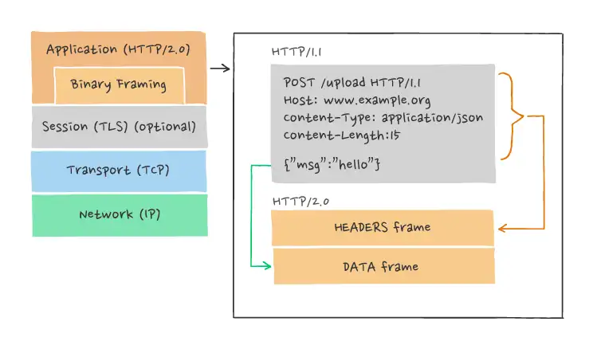

# HTTP/2 Frames

An HTTP/2 frame is the smallest unit of communication within an HTTP/2 connection, encapsulating a specific type of data or control message. Each frame consists of a header and a variable-length payload. The frame header includes the frame length, type, flags, and stream identifier, which together dictate how the frame should be processed. The payload's structure and content depend on the frame type.

Frames are the building blocks of HTTP/2 communication, used for everything from transmitting request and response headers and bodies (via `DATA` frames) to controlling the flow of data and managing the state of the connection (e.g., with `SETTINGS`, `WINDOW_UPDATE`, and `GOAWAY` frames). Because HTTP/2 is a binary protocol, frames allow for more efficient parsing, reduced latency, and enhanced multiplexing capabilities compared to the text-based HTTP/1.x protocol.

The introduction of frames and the binary framing layer in HTTP/2 enables several key improvements over HTTP/1.x, including:

* __Stream Multiplexing__. Multiple frames from different streams can be intermixed on a single connection, allowing for concurrent requests and responses without the head-of-line blocking that HTTP/1.x suffers from.

* __Stream Prioritization__. Frames associated with different streams can carry priority information, allowing the server to better manage resource allocation and response ordering to optimize performance.

* __Flow Control__. `DATA` frames are subject to flow control at the stream and connection level, ensuring that senders do not overwhelm receivers.

* __Server Push__. The `PUSH_PROMISE` frame type allows servers to preemptively send resources to clients, potentially reducing load times by anticipating client needs.

Each frame serves a distinct function within the HTTP/2 ecosystem, making the protocol more efficient and effective for modern web applications.

## Frame Structure

The HTTP/2 frame structure is designed to be compact and efficient, enabling sophisticated control over data exchange and stream management within an HTTP/2 connection. Every frame in HTTP/2 follows a binary format and consists of a fixed-length header followed by a variable-length payload, the specifics of which depend on the frame type. Here’s a breakdown of the HTTP/2 frame structure:

1. __Frame Header__

* __Length (3 bytes)__: Specifies the length of the frame payload in bytes and does not include the 9 bytes of the frame header itself. This means the maximum size of a frame's payload is 2^24-1 bytes, though in practice, this is often limited to a smaller size, typically 16KB by default, but can be negotiated between the client and server.

* __Type (1 byte)__: Indicates the type of frame (e.g., `DATA`, `HEADERS`, `SETTINGS`, determining the format and semantics of the payload.

* __Flags (1 byte)__: Provides additional information specific to the frame type. Flags can indicate various options like whether a header frame is to be followed by `CONTINUATION` frames or if a `DATA` frame is the last in a series.

* __R (1 bit)__: A reserved bit that is always set to 0 and must be ignored when received.

* __Stream Identifier (31 bits)__: Identifies the stream to which the frame belongs. A value of 0 is reserved for frames that are associated with the connection as a whole rather than an individual stream.

2. __Frame Payload__

* __Variable Length__: The contents of the payload depend on the frame type. For example, a `DATA` frame’s payload consists of the application data being transmitted, while a `HEADERS` frame’s payload includes compressed HTTP header fields.

* __Specific Fields__: Depending on the frame type, the payload may contain additional fields. For instance, a `SETTINGS` frame contains a set of parameter-value pairs, and a `PRIORITY` frame includes priority information for a stream.

## Frame Types

HTTP/2 introduces several frame types as part of its binary framing layer. Each frame type serves a specific purpose in the HTTP/2 communication protocol, from initiating and managing streams to controlling the flow of data. Here are the primary frame types defined in HTTP/2:

1. `DATA`

* __Purpose__: Used to carry the payload data of the request or response body.
* __Details__: `DATA` frames are subject to flow control and can be associated with specific streams.

2. `HEADERS`

* __Purpose__: Used for opening a stream and sending header data. The `HEADERS` frame carries the HTTP headers.
* __Details__: This frame can also carry priority information about the stream it is associated with.

3. `PRIORITY`

* __Purpose__: Specifies the sender-advised priority of a stream.
* __Details__: It can be sent for a new or existing stream and enables the stream to be prioritized without carrying any additional data.

4. `RST_STREAM`

* __Purpose__: Allows for the immediate termination of a stream.
* __Details__: When sent, the `RST_STREAM` frame signals that a stream is being prematurely closed due to an error or other condition.

5. `SETTINGS`

* __Purpose__: Conveys configuration parameters about the communication session.
* __Details__: Both clients and servers use `SETTINGS` frames at the start of a connection to agree on communication settings like frame sizes and concurrent streams. A SETTINGS frame must be acknowledged by the receiver.

6. `PUSH_PROMISE`

* __Purpose__: Used for server push. This frame type is sent to indicate that the server intends to push resources to the client.
* __Details__: A `PUSH_PROMISE` frame contains headers of a request that the server anticipates the client will need, effectively allowing the server to initiate requests on behalf of the client.

7. `PING`

* __Purpose__: Serves as a mechanism to test the connection's liveness and measure round-trip time.
* __Details__: The `PING` frame is sent from one endpoint to the other and must be returned unchanged by the receiver.

8. `GOAWAY`

* __Purpose__: Used to initiate shutdown of a connection.
* __Details__: The `GOAWAY` frame informs the receiving endpoint that the sender is about to close the connection. It also helps in error recovery and graceful shutdown by indicating the last stream identifier that was processed successfully.

9. `WINDOW_UPDATE`

* __Purpose__: Used for flow control.
* __Details__: The `WINDOW_UPDATE` frame is sent to manage the flow of `DATA` frames, ensuring that a sender does not overwhelm a receiver. It specifies the number of bytes that the sender is permitted to transmit in addition to what is already specified.

10. `CONTINUATION`

* __Purpose__: Used to continue a sequence of header block fragments.
* __Details__: A CONTINUATION frame is used when a single logical header block is too large to fit into a single frame. It must be followed by `HEADERS`, `PUSH_PROMISE`, or `CONTINUATION` frames.

Each frame type has a specific role in the HTTP/2 protocol, facilitating efficient, flexible, and robust communication between clients and servers.

#http-2-frames
