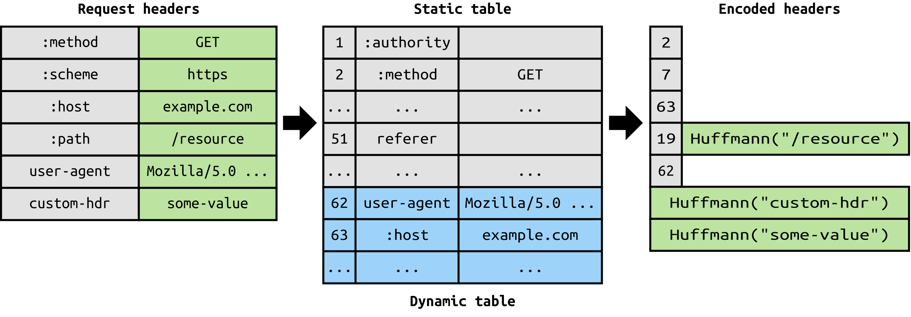

# HTTP/2 Header Compression

HTTP/2 introduces a sophisticated mechanism for header compression called __HPACK__. This innovation addresses one of the inefficiencies of HTTP/1.x, where header data, often largely redundant across requests, is sent in full with each request and response. HPACK compression significantly reduces the size of headers, decreasing latency, and improving web performance, especially in scenarios where headers make up a substantial portion of the message size.

## How HPACK Works

HPACK compression operates on the principle of reducing redundancy through two main strategies:

* __Static Table__: HPACK utilizes a predefined list of common HTTP header fields and values (known as the static table). Many standard headers can be represented by a single index number when transmitted, which significantly reduces the amount of data sent across the wire.

* __Dynamic Table__: Alongside the static table, HPACK uses a dynamic table that is built and maintained throughout the duration of an HTTP/2 connection. The dynamic table stores headers encountered during the connection. Future headers that match those in the dynamic table can be efficiently encoded using an index reference, further reducing redundancy. The dynamic table is updated with new or modified headers over time, optimizing the compression based on the specific usage pattern of the connection.

Headers are encoded into a series of HPACK instructions, which include indexed representations (using static or dynamic table indexes), literal representations (with or without indexing), and table size updates. This approach allows HPACK to adaptively compress headers in a way that reflects the actual headers being used in the connection.

## Benefits

* __Reduced Overhead__: By minimizing the size of headers, HPACK reduces the amount of data transmitted between client and server. This is particularly beneficial for mobile or slow networks, where every byte can impact performance.

* __Improved Security__: HPACK helps mitigate certain types of security vulnerabilities associated with compression, such as CRIME attacks, by using Huffman coding to encode header values and limiting the exposure of information through external compression state.

## Challenges and Considerations

While HPACK represents a significant advancement in header compression, it requires careful management of the dynamic table and an understanding of the security implications of shared compression context across multiple streams. Implementers must balance the size of the dynamic table and the computational overhead of compression and decompression operations against the benefits of reduced header size.

In summary, HPACK header compression is a key feature of HTTP/2 that enhances web performance and efficiency by addressing the redundancy and size of HTTP headers. Its design reflects a careful consideration of the needs for efficiency, security, and adaptability in web communications.

## Links

* RFC 7541 - HPACK https://datatracker.ietf.org/doc/rfc7541
* https://blog.cloudflare.com/hpack-the-silent-killer-feature-of-http-2

#http-2-header-compression
