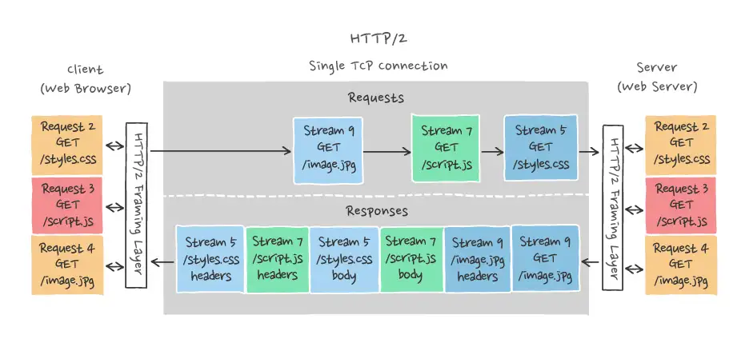
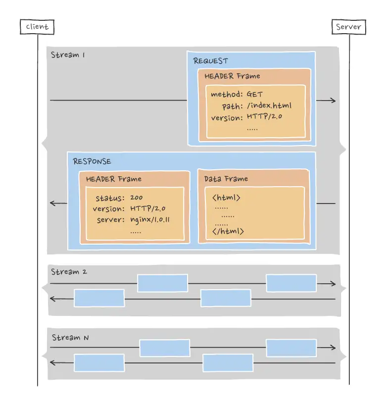

# HTTP/2 Multiplexing

HTTP/2 multiplexing is a feature that significantly enhances the efficiency and performance of web communications. It addresses a fundamental limitation of HTTP/1.x, where each request must wait for the previous one to complete before starting, leading to a bottleneck known as "head-of-line blocking." In contrast, HTTP/2 allows multiple requests and responses to be in flight simultaneously over a single TCP connection. This section will explore how HTTP/2 multiplexing works and its benefits.

## How HTTP/2 Multiplexing Works

* __Binary Framing Layer__: At the core of HTTP/2 is a binary framing layer that encapsulates HTTP messages into small frames, enabling more efficient processing and flexibility. This binary layer is fundamental to multiplexing, as it allows distinct streams of frames to be interwoven on the same connection.

* __Streams__: A stream in HTTP/2 is an independent, bi-directional sequence of frames exchanged between the client and server within the same connection. Each stream has a unique identifier and can carry one or more messages, allowing multiple requests and responses to be multiplexed.

* __Frame Interleaving__: Frames from different streams can be mixed together, or interleaved, on the connection. This means that data from multiple requests and responses can be transmitted back and forth as soon as they are available, without waiting for any one transaction to complete.

* __Flow Control and Prioritization__: HTTP/2 provides mechanisms for flow control and prioritization at the stream level. This ensures that critical resources can be delivered first, and that neither the client nor the server overwhelms the other with too much data at once.

## Benefits

* __Reduced Latency__: By allowing multiple requests and responses to be transmitted over a single connection without waiting for each to complete, multiplexing significantly reduces overall latency.

* __Efficient Use of TCP__: Multiplexing over a single TCP connection reduces the overhead and performance penalties associated with establishing multiple connections, making more efficient use of the underlying TCP connection.

* __Elimination of Head-of-Line Blocking__: Multiplexing eliminates HTTP/1.x's head-of-line blocking problem at the application layer, as multiple streams can progress independently.

* __Improved Resource Prioritization__: With stream prioritization, critical resources can be sent first, improving the performance of web applications, especially in scenarios where certain resources are dependent on others.

* __Enhanced User Experience__: Faster page loads and more responsive applications directly contribute to a better user experience.

HTTP/2's introduction of multiplexing marked a significant step forward in web performance optimization. By overcoming the limitations of HTTP/1.x and enabling more efficient use of network resources, HTTP/2 has become a critical technology for modern web applications.

#http-2-multiplexing
