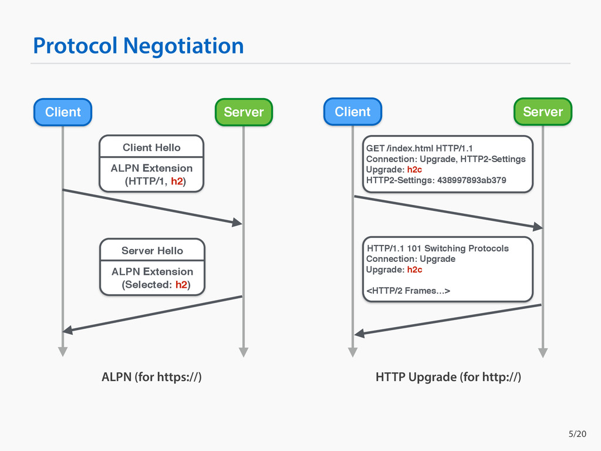

# HTTP/2 Negotiation

HTTP/2 negotiation mechanisms are essential for establishing communication using the HTTP/2 protocol between clients and servers. There are three primary methods for negotiating the use of HTTP/2: Application-Layer Protocol Negotiation (ALPN), Prior Knowledge, and the HTTP Upgrade header. Each method serves different use cases and operational environments.

1. __Application-Layer Protocol Negotiation (ALPN)__

ALPN is the most widely used method for negotiating HTTP/2, primarily because it's integrated into the Transport Layer Security (TLS) handshake process, making it both efficient and secure.

* __Process__: During the TLS handshake, the client sends a list of supported protocols, including HTTP/2 (represented as "h2"), as part of the `ClientHello` message. The server, upon receiving this list, selects a protocol for use during the connection and communicates its choice back to the client in the ServerHello message. If both the client and server support HTTP/2 and the server chooses it, the connection proceeds using HTTP/2.

* __Advantages__: Secure and efficient; part of the initial TLS handshake, so it doesn't introduce additional round-trips.

* __Use Case__: Preferred for secure HTTP/2 communication over TLS, widely supported by modern web servers and clients.

2. __Prior Knowledge__

This method of negotiation assumes that both the client and server already "know" that the other party supports HTTP/2. It's typically used for HTTP/2 over clear text (h2c).

* __Process__: The client starts the communication by sending an HTTP/2 connection preface, which is a specific sequence that signals the beginning of an HTTP/2 connection. This is only possible if both parties have been configured or designed to communicate using HTTP/2 from the outset.

* __Advantages__: Eliminates the need for negotiation, allowing for immediate use of HTTP/2 features.

* __Use Case__: Limited to scenarios where there is absolute certainty about both parties' support for HTTP/2, such as within controlled internal networks or services where both client and server configurations are known.

3. __HTTP Upgrade__

The HTTP Upgrade mechanism is part of the HTTP/1.1 protocol, allowing clients to request an upgrade to a different protocol (e.g., HTTP/2) within the same connection.

* __Process__: The client sends an HTTP/1.1 request with an Upgrade header specifying "h2c" for HTTP/2 over clear text. If the server supports and agrees to switch to HTTP/2, it responds with a 101 (Switching Protocols) status code, and the connection is upgraded to HTTP/2.

* __Advantages__: Provides a pathway to HTTP/2 for clients and servers initially communicating via HTTP/1.1. It's particularly useful for upgrading to HTTP/2 over clear text.

* __Use Case__: More commonly used for upgrading from HTTP/1.1 to HTTP/2 without encryption (h2c). However, due to security concerns, its use is less common compared to ALPN.

While ALPN is the preferred and most secure method for negotiating HTTP/2, especially over TLS, the Prior Knowledge and HTTP Upgrade methods offer alternatives for scenarios where ALPN might not be suitable or available. Each method has its context and advantages, with ALPN leading in terms of security, efficiency, and widespread adoption.

#http-2-negotiation
