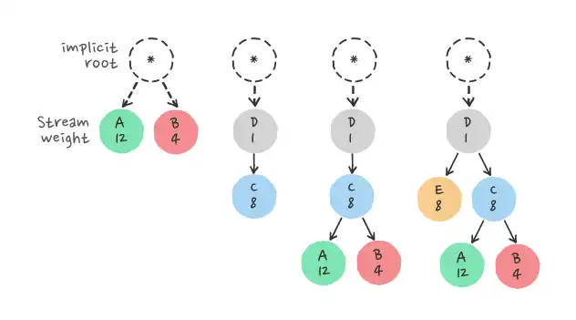

# HTTP/2 Stream Prioritization

HTTP/2 stream prioritization is a feature that allows clients to indicate their preference regarding the order in which multiple in-flight requests (or streams) should be processed and responded to by the server. This mechanism is crucial for optimizing the utilization of resources and improving the performance and responsiveness of web applications. It addresses the challenge of ensuring that the most important resources are loaded first, thus enhancing the user's experience, especially in environments with constrained bandwidth or processing power.

## How Stream Prioritization Works

Stream prioritization in HTTP/2 is achieved through a combination of dependencies and weightings assigned to streams:

* __Dependencies__: A stream can be declared dependent on another stream, creating a parent-child relationship. This tells the server that the parent stream should be completed before proceeding with its dependent (child) streams. Dependencies can be exclusive or non-exclusive, allowing for fine-grained control over the order of stream processing.

* __Weighting__: Each stream can also be assigned a weight between 1 and 256, indicating its relative importance compared to other streams. A higher weight suggests that a stream should be allocated more resources or bandwidth. Weights provide a way to express the priority of streams within the same dependency level.

The combination of dependencies and weights allows clients to construct a prioritization tree, which servers use to decide the order of processing and resource allocation. This prioritization scheme is dynamic; clients can adjust the priorities of streams in real-time by sending `PRIORITY` frames.

## Benefits

* __Improved Resource Loading__: By enabling clients to specify the importance and dependencies of requests, critical resources (such as CSS and JavaScript files critical for rendering) can be loaded earlier, improving the perceived performance of web applications.

* __Enhanced User Experience__: Faster loading of important resources directly contributes to a smoother and more responsive user experience, as users can interact with parts of a webpage sooner.

* __Efficient Use of Bandwidth__: Prioritization ensures that bandwidth is allocated to the most important resources first, which is particularly beneficial in constrained network conditions.

* __Flexibility__: The dynamic nature of stream prioritization allows clients to adjust their strategies based on changing conditions or user interactions, further optimizing the use of resources throughout the lifecycle of a connection.

## Challenges and Considerations

While stream prioritization offers significant benefits, its effectiveness depends on proper implementation by both clients and servers. Misconfigured priorities can lead to suboptimal performance. Moreover, not all servers may fully or optimally implement HTTP/2's prioritization scheme, leading to inconsistencies in real-world applications. Developers need to be mindful of these potential issues when designing applications to leverage HTTP/2's capabilities fully.

In summary, HTTP/2 stream prioritization is a powerful feature designed to optimize the loading of web resources. When used effectively, it can significantly enhance the performance and user experience of web applications.

#http-2-stream-prioritization
