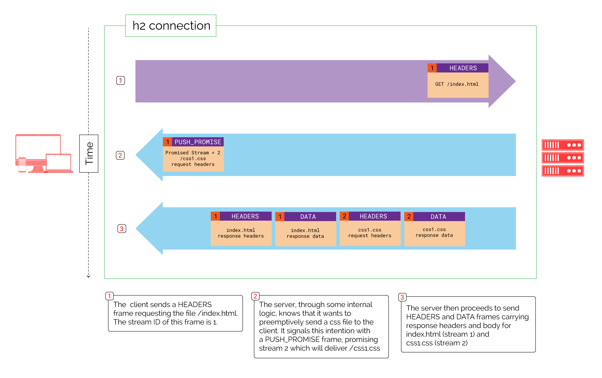

# HTTP/2 Server Push

HTTP/2 server push is a feature that allows servers to preemptively send resources to a client before the client explicitly requests them. This capability is designed to improve the efficiency of web loading times by reducing the latency associated with initiating multiple round-trips between the client and server for resources. By anticipating and pushing the necessary resources to clients, servers can potentially optimize the overall user experience, making web applications faster and more responsive.

## How Server Push Works

1. __Initiation__: Server push is initiated when the server decides that the client will likely need a specific resource to complete a request or to render a web page fully. For example, if a client requests an HTML document, the server can infer that certain CSS stylesheets, JavaScript files, or images referenced by the document will also be needed.

2. __PUSH_PROMISE Frame__: Before sending the anticipated resources, the server sends a `PUSH_PROMISE` frame to the client. This frame contains the headers of the hypothetical request for the resource the server intends to push. The `PUSH_PROMISE` frame effectively reserves a stream for the push resource, preventing the client from independently requesting the same resource and avoiding duplication.

3. __Data Transmission__: After sending the `PUSH_PROMISE` frame, the server proceeds to send the pushed resource as if it had been requested by the client, using DATA frames. This is done on the reserved stream ID specified in the `PUSH_PROMISE` frame.

4. __Client Handling__: Upon receiving a `PUSH_PROMISE` frame, the client has the option to accept or reject the push. If the client accepts the push, it will process the incoming resource as if it had explicitly requested it. If the client rejects the push, typically because the resource is already cached or not needed, it can send a `RST_STREAM` frame to cancel the push.

## Benefits

* __Reduced Latency__: By preemptively sending resources, server push can eliminate the latency that would otherwise be incurred by the client having to make separate requests for each resource after discovering their need.

* __Improved Page Load Times__: Pushing critical resources needed for initial rendering can significantly improve the time to first render and overall page load times, leading to a better user experience.

* __Efficient Resource Utilization__: Server push can make efficient use of a single TCP connection, reducing the overhead and inefficiencies associated with opening multiple connections or dealing with HTTP/1.x's head-of-line blocking.

## Considerations and Challenges

* __Resource Prioritization__: Servers must carefully decide which resources to push to avoid overwhelming the client or consuming bandwidth with unnecessary or unimportant resources.

* __Cache Awareness__: Effective server push requires the server to be aware of the client's cache state to avoid pushing resources the client already has. This can be challenging to manage accurately.

* __Potential for Wasted Bandwidth__: If not used judiciously, server push can lead to bandwidth waste, especially if resources are pushed that the client does not need or already has cached.

Despite its potential benefits, HTTP/2 server push requires thoughtful implementation and consideration of client behavior and network conditions. When used effectively, it can be a powerful tool for optimizing web performance and user experience.

#http-2-server-push
