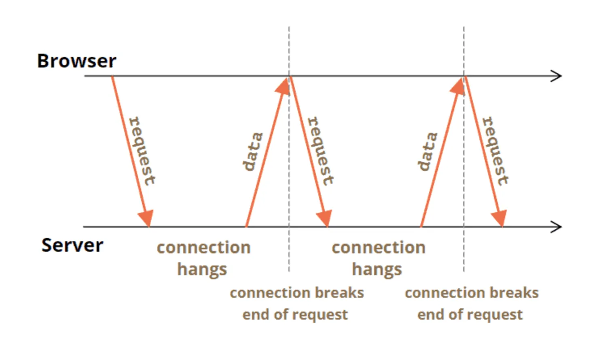

## Long Polling

Long polling is a technique used in web development to emulate a real-time connection between a client (such as a web browser or mobile app) and a server. It's one of the methods used to enable servers to push information to the client as soon as new data becomes available. Long polling is often considered a compromise between conventional polling and more advanced technologies like WebSockets, particularly in environments where real-time functionality is needed but the use of WebSockets may not be feasible due to compatibility or organizational policy constraints.

## How Long Polling Works

1. __Initial Client Request__: The client makes a standard HTTP request to the server to ask for new data.

2. __Server Holding the Request__: Unlike typical HTTP requests that are processed and responded to immediately, in long polling, the server holds the request open (i.e., does not send a response immediately). It waits until new data is available or a certain timeout is reached.

3. __Server Response__: When new data becomes available, the server sends a response back to the client with the new data. If the timeout is reached without any new data, the server sends a response indicating that no new data is available.

4. __Client Reconnection__: After receiving the server's response, the client immediately issues another HTTP request, thus re-establishing the long polling loop. This process continues repeatedly for the duration of the client's session.



## Characteristics and Benefits

* __Reduced Number of Requests__: Unlike traditional polling, where the client might request data at regular intervals regardless of whether new data is available, long polling reduces the number of requests by maintaining a request open until something is actually ready to be sent to the client. This reduces unnecessary network traffic and load on the server.

* __Quicker Updates__: Long polling allows the client to get updates almost immediately after the server has new information available, rather than waiting for the next scheduled poll time.

## Challenges and Drawbacks

* __Resource Utilization__: Each long polling request typically holds open a network connection. If many clients are connected via long polling, this can lead to a significant amount of open connections, which may consume substantial server resources. _Not relevant for HTTP/2 and HTTP/3_.

* __Scalability__: Due to its heavy use of server resources, scaling long polling can be challenging. It may require sophisticated server management and infrastructure optimization to handle large numbers of concurrent connections. _Not relevant for HTTP/2 and HTTP/3_.

* __Latency and Timeouts__: There is inherent latency in the system due to the time it takes to re-establish a connection after each received response. Additionally, managing timeouts can be tricky, as different network environments may behave differently (e.g., some proxies might drop idle connections).

## Typical Use Cases

* __Notification Systems__: Where a client needs to be updated sporadically (but immediately) when new notifications are available.

* __Chat Applications__: In scenarios where real-time chat functionality is needed without the complexity or overhead of WebSockets.

* __Live Content Updates__: For updating live content such as news feeds or social media streams, where real-time interactivity is less critical but updates are needed promptly.

## Alternatives

* __WebSockets__: Provide a true real-time, full-duplex communication channel.

* __Server-Sent Events (SSE)__: Better suited for unidirectional communication from server to client, with built-in support for reconnection and lower overhead than long polling.

## Example

### Client

```javascript
<!DOCTYPE html>
<html lang="en">
<head>
<meta charset="UTF-8">
<title>Long Polling Client</title>
<script>
const clientId = "client" + Math.random().toString(36).substring(2, 15); // Generate a random client ID

async function subscribe() {
    const url = `http://localhost:5000/polling/subscribe/${clientId}`;
    try {
        const response = await fetch(url);
        if (response.ok) {
            const message = await response.text();
            console.log('Received:', message);
            subscribe(); // Subscribe again
        } else {
            console.error('Subscription failed');
            setTimeout(subscribe, 5000); // Retry after a delay
        }
    } catch (error) {
        console.error('Failed to subscribe:', error);
        setTimeout(subscribe, 5000); // Retry after a delay
    }
}

document.addEventListener('DOMContentLoaded', subscribe);
</script>
</head>
<body>
<h1>Long Polling Example</h1>
<p>Check the console for incoming messages. Client ID: <strong>${clientId}</strong></p>
</body>
</html>
```

### Server using ASP.NET Core

`EventsChannelService.cs`:

```csharp
public class EventsChannelService
{
    private readonly ConcurrentDictionary<string, Channel<string>> _clientChannels = new ConcurrentDictionary<string, Channel<string>>();

    public async Task PublishAsync(string clientId, string message)
    {
        if (_clientChannels.TryGetValue(clientId, out var channel))
        {
            await channel.Writer.WriteAsync(message);
        }
    }

    public async Task<string> WaitForNextEventAsync(string clientId, CancellationToken cancellationToken)
    {
        var channel = _clientChannels.GetOrAdd(clientId, _ => Channel.CreateUnbounded<string>());

        return await channel.Reader.ReadAsync(cancellationToken);
    }
}
```

`PollingController.cs`:

```csharp
using Microsoft.AspNetCore.Mvc;

[ApiController]
[Route("[controller]")]
public class PollingController : ControllerBase
{
    private readonly EventsChannelService _eventsChannelService;

    public PollingController(EventsChannelService eventsChannelService)
    {
        _eventsChannelService = eventsChannelService;
    }

    [HttpGet("subscribe/{clientId}")]
    public async Task<IActionResult> Subscribe(string clientId)
    {
        var cancellationToken = HttpContext.RequestAborted;
        try
        {
            var message = await _eventsChannelService.WaitForNextEventAsync(clientId, cancellationToken);
            return Ok(message);
        }
        catch (OperationCanceledException)
        {
            return NoContent();
        }
    }

    [HttpPost("publish/{clientId}")]
    public async Task<IActionResult> Publish(string clientId, [FromBody] string message)
    {
        await _eventsChannelService.PublishAsync(clientId, message);
        return Ok();
    }
}
```

Long polling is useful in scenarios where the client-server communication requires a more immediate response than what traditional polling can offer, but where the use of more sophisticated technologies like WebSockets may not be appropriate or supported.

#long-polling
