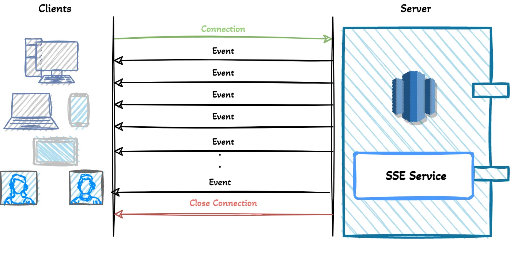

# Server-Sent Events

Server-Sent Events (SSE) is a technology that enables servers to send updates to the client over a single, long-lived HTTP connection. It is particularly useful for applications that require real-time data flow from the server to the client, such as live blogs, news feeds, or real-time monitoring dashboards. SSE is part of the HTML5 standard and offers a more efficient and simpler alternative to techniques like long polling.

## How Server-Sent Events Work

1. __Connection Establishment__: The client initiates the SSE connection by making an HTTP request to the server. This is a standard HTTP request, but it includes an "Accept" header set to "text/event-stream", indicating that the client is ready to receive streaming data.

2. __Data Streaming__: Once the connection is established, the server can begin sending data to the client in a stream. Each piece of data is sent as an "event". These events are formatted as plain text and can contain multiple fields:

  * `data`: Contains the actual data payload.
  * `id`: An optional unique identifier for that event.
  * `event`: An optional name for the event type, which can be used by the client to trigger different actions based on the event type.
  * `retry`: An optional interval in milliseconds that the client should wait before attempting to reconnect if the connection is lost.

3. __Maintaining the Connection__: If the connection is closed by the client or due to some error, the client will automatically try to re-establish the connection using the same endpoint. If the server provided an `id` with the last event, the client can send this back to the server in a `Last-Event-ID` header to allow the server to resume from the last event sent.

## Features and Benefits

* __Built-in Browser Support__: Most modern browsers support SSE natively, which simplifies the implementation as there is no need for any additional libraries or plugins.

* __Automatic Reconnection__: The browser automatically handles reconnections in case of a connection drop, using the last event ID to ensure continuity of the data stream.

* __Reduced Complexity__: Unlike WebSockets, SSE is a simpler protocol to implement, especially when only unidirectional communication (server to client) is required.

* __Efficiency__: SSE connections can remain open indefinitely, and the server can send messages at will without the overhead of re-establishing connections or the overhead of HTTP headers with each message.



## Limitations

* __Unidirectional__: SSE only supports data flow from server to client. If bidirectional communication is needed, other technologies like WebSockets might be more appropriate.

* __Proxy and Firewall Issues__: Some network proxies and firewalls are not configured to handle long-lived HTTP connections well, which can lead to connections being dropped unexpectedly. _Not relevant for HTTP/2 and HTTP/3_.

## Typical Use Cases

* __Live Notifications__: SSE is ideal for applications that need to push updates to the client, such as notifying users of new emails or social media posts.

* __Real-time Data Feeds__: Applications that display real-time information like stock tickers, sports scores, or live statistics can use SSE to stream updates to the client as soon as they become available.

* __Monitoring Dashboards__: SSE can be used to push updates to a dashboard that monitors the status of various systems or processes in real-time.

In summary, Server-Sent Events provide a straightforward method for web servers to communicate with clients over HTTP in a way that is designed to be efficient, easy to use, and supported by the web platform. It’s particularly good for scenarios requiring frequent updates from the server to the client in environments where complex setups like WebSockets may not be necessary or ideal.

## Example

### Message

```
id: 67890
event: messageUpdate
data: First line of the message.
data: Second line of the message.
retry: 7000
```

### Client

To handle this on the client side using JavaScript, you would typically use an `EventSource` interface which is designed specifically for handling SSE. Here is an example of how you might set up an event listener for the "cryptoDepositCreated" event type:

```javascript
var eventSource = new EventSource('https://example.com/events');
eventSource.onmessage = function(event) {
  console.log('New message:', event.data);
};

eventSource.addEventListener('update', function(event) {
  console.log('Received an event:', event.data);
  console.log('Event ID:', event.lastEventId);
});

eventSource.onerror = function(event) {
  console.error('Error occurred:', event);
};
```

In this setup:

* `eventSource.onmessage` is used to handle generic messages that don't specify an event type.
* `eventSource.addEventListener('update', ...)` is used to handle messages of type "update".
* Each handler receives an event object that contains the data and `lastEventId` from the SSE message, and potentially other attributes like the event type.

### Server using ASP.NET Core

`SseService.cs`:

```csharp
using System.Collections.Concurrent;
using System.Threading.Channels;
using Microsoft.AspNetCore.Http;

public class SseService
{
    private readonly ConcurrentDictionary<string, Channel<string>> _clients = new ConcurrentDictionary<string, Channel<string>>();

    public ChannelReader<string> AddClient(string clientId)
    {
        var channel = Channel.CreateUnbounded<string>();
        _clients.TryAdd(clientId, channel);
        return channel;
    }

    public void RemoveClient(string clientId)
    {
        if (_clients.TryRemove(clientId, out var channel))
        {
            channel.Writer.Complete();
        }
    }

    public async Task SendMessageAsync(string clientId, string message)
    {
        if (_clients.TryGetValue(clientId, out var channel))
        {
            await channel.Writer.WriteAsync(message);
        }
    }
}
```

`SseController.cs`:

```csharp
using Microsoft.AspNetCore.Mvc;

[ApiController]
[Route("[controller]")]
public class SseController : ControllerBase
{
    private readonly SseService _sseService;

    public SSEController(SseService sseService)
    {
        _sseService = sseService;
    }

    [HttpGet("connect/{clientId}")]
    public async Task Connect(string clientId)
    {
        Response.ContentType = "text/event-stream";

        var messageChannel = _sseService.AddClient(clientId);

        var cancellationToken = HttpContext.RequestAborted;

        try
        {
            await foreach (var message in messageChannel.ReadAllAsync(cancellationToken))
            {
                await Response.WriteAsync($"event: cryptoDepositCreated\n\n");
                await Response.WriteAsync($"data: {message}\n\n");
                await Response.Body.FlushAsync();
            }
        }
        catch (OperationCanceledException)
        {
            // Catch cancellation due to client disconnecting
        }
        finally
        {
            _sseService.RemoveClient(clientId);
        }
    }
}
```

#sse
