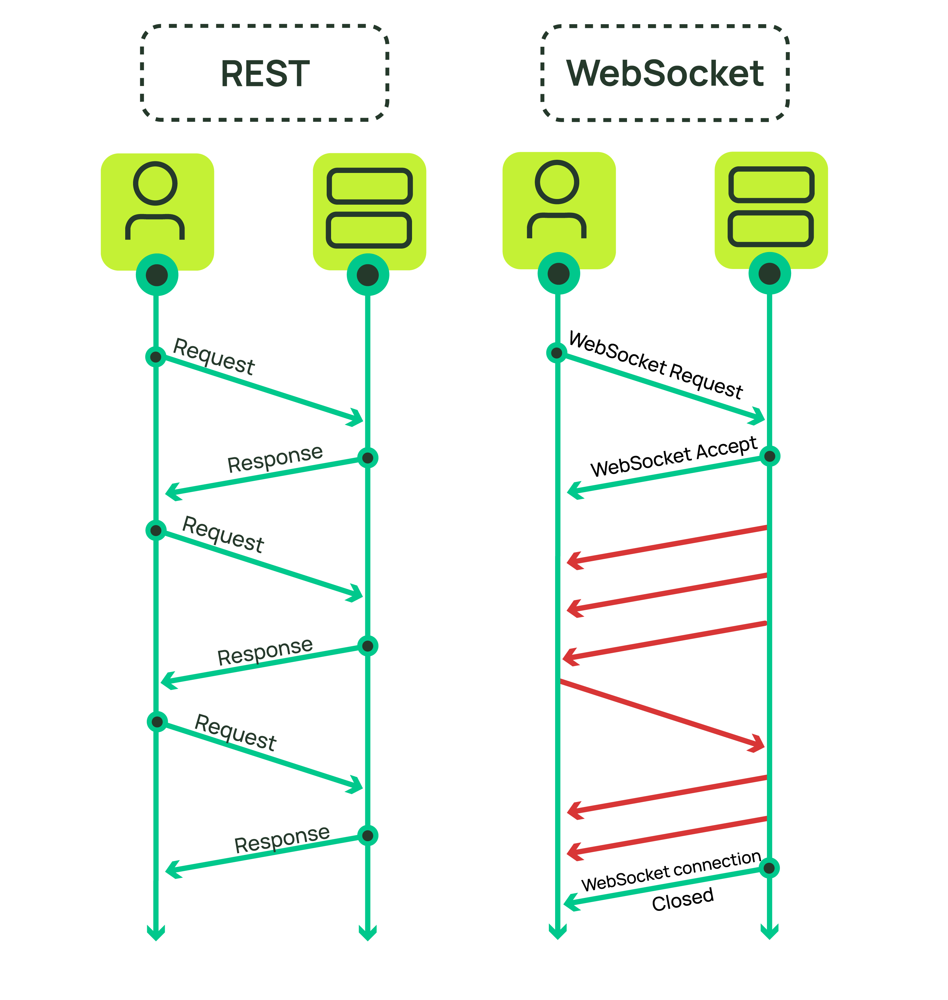

# WebSockets

WebSockets provide a powerful way to enhance the interactivity and performance of web applications by enabling full-duplex communication between the client (such as a web browser) and a server. This technology allows data to flow in both directions simultaneously, without the need for repeatedly establishing connections, which is a limitation of traditional HTTP communications.

## How WebSockets Work

1. __Establishing a Connection__:

  * __Handshake__: The WebSocket communication begins with an HTTP handshake. The client sends a standard HTTP request to the server, which includes an "Upgrade" header indicating the request to initiate a WebSocket connection. The server then responds with an "HTTP/101 Switching Protocols" response, confirming the upgrade from HTTP to WebSockets.

  * __Protocol Switch__: Once the handshake is successful, the protocol switches from HTTP to the WebSocket protocol (ws:// or wss:// for secure WebSockets), establishing a persistent, full-duplex communication channel over a single socket connection.

2. __Data Transmission__:

  * __Frames__: Data is transmitted in frames, which can be of varying lengths and can represent either control messages (such as close, ping, or pong frames) or data messages (text, binary).

  * __Efficiency__: Unlike HTTP, WebSocket does not require HTTP headers for each message, reducing the overhead and latency and making it more suitable for high-frequency and real-time data exchange.

3. __Keeping the Connection Alive__:

  * __Heartbeating__: To ensure the connection remains alive and to detect any potential disconnections, either the client or server can send periodic "ping" messages, to which the recipient must respond with "pong" messages.

## Features and Benefits

* __Real-Time Communication__: WebSockets are ideal for applications that require real-time data updates such as online games, chat applications, and live sports updates.

* __Reduced Latency__: By maintaining a persistent connection and reducing the overhead of HTTP headers, WebSockets minimize the latency associated with the repetitive open/close of HTTP connections.

* __Bidirectional__: Both client and server can initiate data sending, unlike HTTP where client-server communication is typically initiated by the client.

* __Fallback Mechanisms__: In environments where WebSockets are not supported, applications can fall back to older technologies such as long polling or server-sent events, although these may not offer the same performance benefits.



## Use Cases

* __Financial Trading Platforms__: Real-time updates of stock, FOREX, or cryptocurrency prices.

* __Multiplayer Online Games__: Immediate synchronization of player actions and game state across clients.

* __Collaborative Editing Tools__: Simultaneous editing of documents or code with real-time reflection of changes.

## Security Considerations

* __Encryption__: Just like HTTP can be secured with HTTPS, WebSockets can be secured using WebSocket Secure (wss://), which encrypts the data transmitted to prevent eavesdropping and tampering.

* __Authentication and Authorization__: Securing WebSocket connections typically involves implementing custom authentication and authorization mechanisms since WebSockets do not inherently handle these processes.

## Example

### Client

```javascript
<!DOCTYPE html>
<html>
<head>
    <title>WebSocket Client</title>
</head>
<body>
    <script>
        var ws = new WebSocket('ws://localhost:5000');

        ws.onopen = function() {
            console.log('Connected to the server');
            ws.send('Hello, server!');
        };

        ws.onmessage = function(event) {
            console.log('Received: ' + event.data);
        };

        ws.onclose = function(event) {
            console.log('Disconnected from the server');
        };

        ws.onerror = function(error) {
            console.log('WebSocket Error: ' + error);
        };
    </script>
</body>
</html>
```

### Server using ASP.NET Core

`Program.cs`:

```csharp
var builder = WebApplication.CreateBuilder(args);
builder.Services.AddSingleton<WebSocketConnectionManager>();

var app = builder.Build();

app.UseWebSockets();
app.Use(async (context, next) =>
{
    if (context.WebSockets.IsWebSocketRequest)
    {
        var webSocket = await context.WebSockets.AcceptWebSocketAsync();
        var webSocketManager = context.RequestServices.GetRequiredService<WebSocketConnectionManager>();
        await webSocketManager.HandleWebSocketAsync(webSocket);
    }
    else
    {
        await next();
    }
});

app.Run();
```

`WebSocketConnectionManager.cs`:

```csharp
using System.Collections.Concurrent;
using System.Net.WebSockets;
using System.Threading.Channels;

public class WebSocketConnectionManager
{
    private ConcurrentDictionary<string, WebSocket> _sockets = new ConcurrentDictionary<string, WebSocket>();
    private Channel<string> _channel = Channel.CreateUnbounded<string>();

    public WebSocketConnectionManager()
    {
        Task.Run(async () => await BroadcastMessagesAsync());
    }

    public async Task HandleWebSocketAsync(WebSocket webSocket)
    {
        var socketId = Guid.NewGuid().ToString();
        _sockets.TryAdd(socketId, webSocket);

        await ReadMessages(socketId, webSocket);
    }

    private async Task ReadMessages(string socketId, WebSocket webSocket)
    {
        var buffer = new byte[1024 * 4];

        while (webSocket.State == WebSocketState.Open)
        {
            var result = await webSocket.ReceiveAsync(new ArraySegment<byte>(buffer), CancellationToken.None);

            if (result.MessageType == WebSocketMessageType.Text)
            {
                string message = System.Text.Encoding.UTF8.GetString(buffer, 0, result.Count);
                await _channel.Writer.WriteAsync(message);
            }
            else if (result.MessageType == WebSocketMessageType.Close)
            {
                await webSocket.CloseAsync(WebSocketCloseStatus.NormalClosure, "", CancellationToken.None);
                _sockets.TryRemove(socketId, out _);
            }
        }
    }

    private async Task BroadcastMessagesAsync()
    {
        await foreach (var message in _channel.Reader.ReadAllAsync())
        {
            foreach (var socket in _sockets.Values)
            {
                if (socket.State == WebSocketState.Open)
                {
                    await socket.SendAsync(System.Text.Encoding.UTF8.GetBytes(message), WebSocketMessageType.Text, true, CancellationToken.None);
                }
            }
        }
    }
}
```

In summary, WebSockets offer a robust and efficient method for web-based real-time communication, reducing latency, and overhead compared to traditional HTTP while providing a more interactive user experience.

#web-sockets
